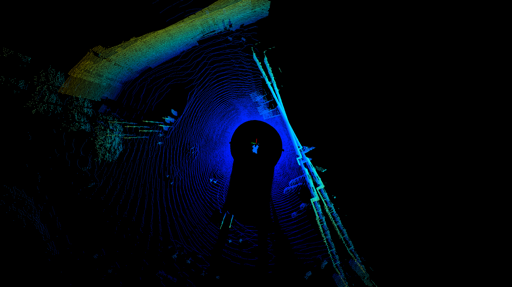
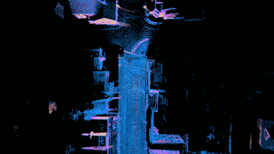
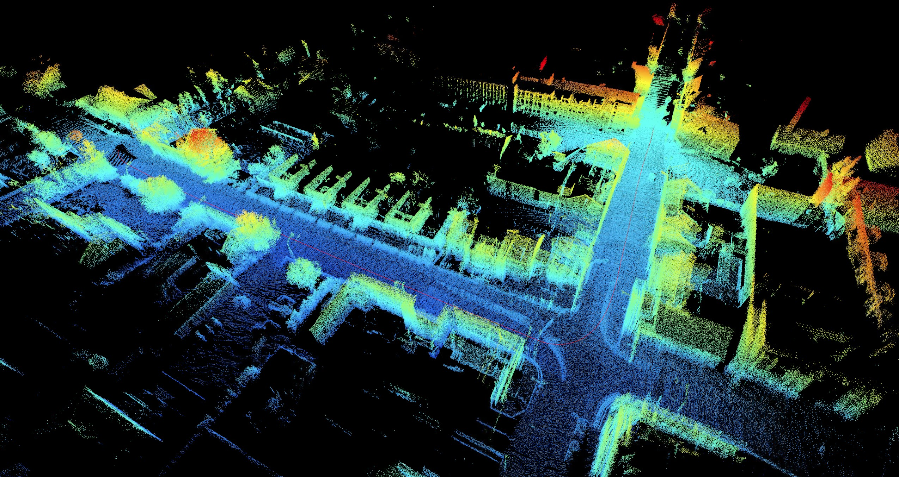

# TEAPOT LIDAR
This repo will contain relevant code for working with [lidar](https://en.wikipedia.org/wiki/Lidar) data in the [SINTEF](https://www.sintef.no) project [TEAPOT](https://www.sintef.no/prosjekter/2021/teapot/).

In this project we will investigate if the lidar data can be used to improve or replace GNSS navigation in two different ways: a) by "incremental navigation", that is by calculating vehicle movements by the difference between sequential lidar frames, and b) by using a georeferenced point cloud to locate a lidar frame.

## Incremental navigation
Incremental navigation works by using [point cloud registration](https://en.wikipedia.org/wiki/Point_set_registration) to calculate a transformation to align two sequential frames from a lidar dataset. This transformation can then be used to calculate how far and in which direction the vehicle moved between these two frames. By doing this for every frame pair in a lidar dataset, we can calculate the total movement. Given an initial GNSS position, the idea is that we can calculate updated GNSS positions throughout the movement without any more GNSS data.

| Two sequential frames with a visible difference | An animation showing the process | The final point cloud with a movement path (red line)
|-----|-----|-----
| [](./notes/frame-matching-test-frames-cropped.png) | [](./notes/animation.gif) | [](./notes/navigated_point_cloud_example.jpg)

More details can be found in the [notes](./notes/notes.md).

## Georeferenced point cloud navigation
_[This part is not yet started.]_

## Requirements
The code is implemented and tested with Python 3.6 because of limitations with some of the libraries. 

Create a new Anaconda environment (or use an existing, or venv, or whatever):
```
conda create -n teapot python=3.6
conda activate teapot
```

Install the Python requirements using pip:

```
pip install -r requirements.txt
```

## Running the code

### Navigator
navigator.py runs through all frames the given PCAP file, and uses the selected registration algorithm to place all frames in the same coordinate system. The vehicle's movements between frames are calculated and visualized as a red line in the final point cloud. Data can be previewed using the --preview argument, and/or saved using the --save-to argument. For debugging, the --frames argument sets a maximum number of frames to be read before finishing, and the --skip-frames argument allows for simulating lower frequencies.

**Example with default preview and no saving:**
```
python navigator.py --pcap path\to\pcap-file.pcap --json path\to\metadata-file.json
```

**Example with default metadata file, no preview, and results saved to the results folder:**
```
python navigator.py --pcap path\to\pcap-file.pcap --preview never --save-to results\[pcap]_[time]
```

**Full argument description:**
```
usage: navigator.py [-h] --pcap PCAP [--json JSON] [--frames FRAMES]
                    [--skip-frames SKIP_FRAMES] [--voxel-size VOXEL_SIZE]
                    [--downsample-after DOWNSAMPLE_AFTER]
                    [--preview {always,end,never}] [--save-to SAVE_TO]
                    [--save-screenshots-to SAVE_SCREENSHOTS_TO]

optional arguments:
  -h, --help            show this help message and exit
  --pcap PCAP           The path to the PCAP file to visualize, relative or
                        absolute.
  --json JSON           The path to the corresponding JSON file with the
                        sensor metadata, relative or absolute. If this is not
                        given, the PCAP location is used (by replacing .pcap
                        with .json).
  --frames FRAMES       If given a number larger than 1, only this many frames
                        will be read from the PCAP file.
  --skip-frames SKIP_FRAMES
                        If given a positive number larger than 0, this many
                        frames will be skipped between every frame read from
                        the PCAP file.
  --voxel-size VOXEL_SIZE
                        The voxel size used for cloud downsampling. If less
                        than or equal to zero, downsampling will be disabled.
  --downsample-after DOWNSAMPLE_AFTER
                        The cloud will be downsampled after this many frames
                        (which is an expensive operation for large clouds, so
                        don't do it too often). If this number is higher than
                        the number of frames being read, it will be
                        downsampled once at the end of the process (unless
                        downsampling is disabled, see --voxel-size).
  --preview {always,end,never}
                        Show constantly updated point cloud and data plot
                        previews while processing ('always'), show them only
                        at the end ('end'), or don't show them at all
                        ('never').
  --save-to SAVE_TO     If given, final results will be stored at this path.
                        The path will be used for all types of results, with
                        appendices depending on file type ('_data.json',
                        '_plot.png', '_cloud.laz', '_cloud.pcd'). The path can
                        include "[pcap]" and/or "[time]" which will be
                        replaced with the name of the parsed PCAP file and the
                        time of completion respectively.
  --save-screenshots-to SAVE_SCREENSHOTS_TO
                        If given, point cloud screenshots will be saved in
                        this directory with their indices as filenames (0.png,
                        1.png, 2.png, etc). Only works if --preview is set to
                        'always'.
```

### PcapBrowser
pcapBrowser.py is a very simple open3d based tool for visualizing the frames in a PCAP file. It allows you to browse the frames using the arrow keys on the keyboard, and can be run like this:

```
python pcapBrowser.py --pcap path\to\pcap-file.pcap --json path\to\metadata-file.json
```

Or, if the pcap and json files have the same names (123.pcap and 123.json), it is sufficient to use the pcap parameter:

```
python pcapBrowser.py --pcap path\to\pcap-file.pcap
```

Note: be wary of spaces in the paths (surround them with quotes).

When the visualization window appears, use the arrow keys to navigate from frame to frame, and P to move through the different cloud processors (None, voxel thinner or ball thinner).
