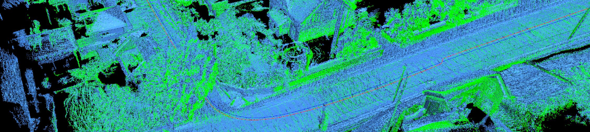
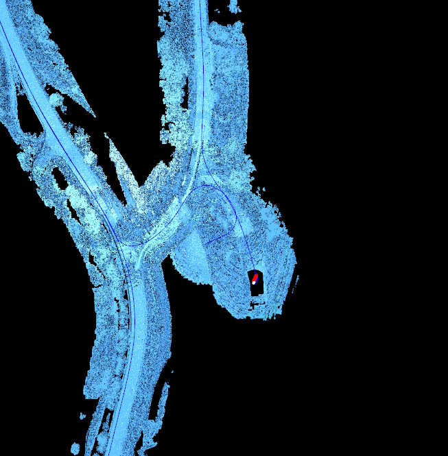
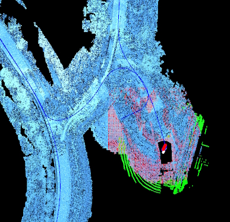
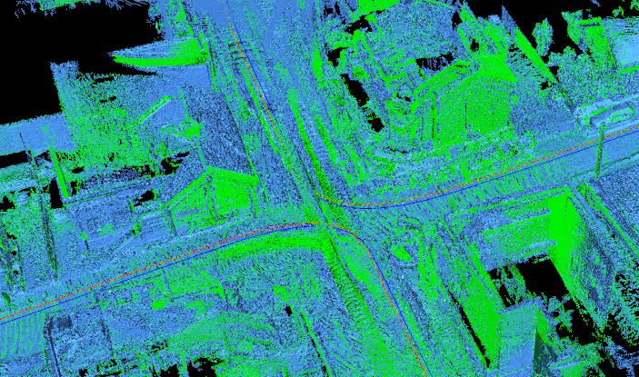

# TEAPOT LIDAR
This repo will contain relevant code for working with [lidar](https://en.wikipedia.org/wiki/Lidar) data in the [SINTEF](https://www.sintef.no) project [TEAPOT](https://www.sintef.no/prosjekter/2021/teapot/).

In this project we will investigate if the lidar data can be used to improve or replace GNSS navigation in two different ways: a) by "incremental navigation", that is by calculating vehicle movements by the difference between sequential lidar frames, and b) by using a georeferenced point cloud to locate a lidar frame.

During the TEAPOT project, LiDAR data was collected from four different locations with and without snow and analyzed using the two nagivation methods outlined below. Detailed analysis results can be found [here](https://github.com/erlenddahl/teapot-lidar/blob/main/validation/_notes/summary.md).

#### Table of Contents
* [Navigation algorithms](#navigation)
  * [Incremental navigation (visual odometry)](#incnav)
  * [Georeferenced point cloud navigation](#absnav)
* [Running the code](#code)
  * [Requirements](#reqs)
  * [Utilities](#utils)
  * [PCAP browser](#pcapbrowser)
  * [Point cloud generation](#pointclouds)
  * [Navigation algorithms](#navigation-code)
    * [Incremental navigation](#nav-inc)
    * [Absolute navigation](#nav-abs)

<a name="navigation"></a>
## Navigation algorithms
In this project, we have developed Python scripts for performing LiDAR navigations using two different techniques: visual odometry, and point cloud navigation. Each of them will be introduced in the following sections, with the Python scripts outlined below.

<a name="incnav"></a>
## Incremental navigation (visual odometry)
Incremental navigation works by using [point cloud registration](https://en.wikipedia.org/wiki/Point_set_registration) to calculate a transformation to align two sequential frames from a lidar dataset. This transformation can then be used to calculate how far and in which direction the vehicle moved between these two frames. By doing this for every frame pair in a lidar dataset, we can calculate the total movement. Given an initial GNSS position, the idea is that we can calculate updated GNSS positions throughout the movement without any more GNSS data. This is equal to a simple visual odometry.

| Two sequential frames with a visible difference are aligned by point cloud registration | An animation showing the alignment process frame by frame | The final point cloud with a movement path (red line)
|-----|-----|-----
| [](./notes/frame-matching-test-frames-cropped.png) | [](./notes/animation.gif) | [](./notes/navigated_point_cloud_example.jpg)

More details can be found in the [technical notes](./notes/notes.md). The python script ```incrementalNavigation.py``` performs incremental navigation on one or more given LiDAR input files. See below for documentation.

<a name="absnav"></a>
## Georeferenced point cloud navigation
Georeferenced navigation (also called "absolute navigation" other places in this repo) means that each lidar frame is registered against an existing pointcloud from the target location, putting the frame directly into a georeferenced location. This gives the position of the frame (and thus the vehicle that is in the center of the frame) directly. Due to constraints in the registration algorithms, it is not feasible to register a frame against a large pointcloud, so there is an intermediate step that extracts a frame-sized part of the cloud around the current location (known or estimated), then registers against that.

| A georeferenced point cloud of the location is loaded (blue). | A part of this point cloud (red) is extracted around the presumed location, and registered against the LiDAR frame (green). | Each LiDAR frame is thus placed within the point cloud, and given a location.
|-----|-----|-----
| [](./notes/absolute01.jpg) | [](./notes/absolute02.jpg) | [](./notes/absolute03.jpg)

The python script ```absoluteNavigation.py``` performs incremental navigation on one or more given LiDAR input files. See below for documentation.

<a name="code"></a>
# Running the code

<a name="reqs"></a>
## Requirements
The code is implemented and tested with Python 3.6 because of limitations with some of the libraries. 

Create a new Anaconda environment (or use an existing, or venv, or whatever), and install the requirements:
```
conda create --name teapot310 python=3.10.9
conda activate teapot310
pip install open3d numpy matplotlib tqdm laspy[laszip] ouster-sdk[examples] tabulate probreg pyproj
```

<a name="utils"></a>
## Utilities

<a name="pcapbrowser"></a>
### Browsing PCAP files
pcapBrowser.py is a very simple open3d based tool for visualizing the frames in a PCAP file. It allows you to browse the frames using the arrow keys on the keyboard, and can be run like this:

```
# Basic example providing both a .pcap file and a (required) metadata .json file:
python pcapBrowser.py --pcap path\to\pcap-file.pcap --json path\to\metadata-file.json

# Or, if the pcap and json files have the same names (123.pcap and 123.json), it is sufficient to use the pcap parameter:
python pcapBrowser.py --pcap path\to\pcap-file.pcap
```

**Full argument description:**
```
usage: pcapBrowser.py [-h] --pcap PCAP [PCAP ...] [--json JSON [JSON ...]] --sbet SBET [--sbet-z-offset SBET_Z_OFFSET]
                      [--max-frame-radius MAX_FRAME_RADIUS] [--recreate-caches]
                      [--save-screenshots-to SAVE_SCREENSHOTS_TO]

options:
  -h, --help            show this help message and exit
  --pcap PCAP [PCAP ...]
                        The path to one or more PCAP files to visualize, relative or absolute. A path to a directory
                        containing multiple pcap files can also be provided.
  --json JSON [JSON ...]
                        The path to corresponding JSON file(s) for each of the PCAP file(s) with the sensor metadata,
                        relative or absolute. If this is not given, the PCAP location is used (by replacing .pcap with
                        .json). A path to a directory containing multiple json files can also be provided.
  --sbet SBET           The path to a corresponding SBET file with GNSS coordinates.
  --sbet-z-offset SBET_Z_OFFSET
                        If the GNSS positions in the SBET file have an altitude offset from the point cloud, this
                        argument will be added/subtracted on the Z coordinates of each SBET coordinate.
  --max-frame-radius MAX_FRAME_RADIUS
                        If given as a number larger than 0, all PCAP frames will be reduced in size by removing all
                        points that are further away from the origin than this value (measured in meters).
  --recreate-caches
  --save-screenshots-to SAVE_SCREENSHOTS_TO
                        If given, point cloud screenshots will be saved in this directory with their indices as
                        filenames (0.png, 1.png, 2.png, etc). Only works if --preview is set to 'always'.
```

Note: be wary of spaces in the paths (surround them with quotes).

When the visualization window appears, use the arrow keys to navigate from frame to frame, and P to move through the different cloud processors (None, voxel thinner or ball thinner). Pressing the I key prints detailed information about this frame.

<a name="pointclouds"></a>
### Point cloud generation
The pointCloud.py script reads a folder of .laz files, and combines them into one large point cloud, which is saved as a Open3D .pcd file. Due to float rounding issues, the .laz files are first read once (header only) to generate a common minimum, and then all .laz files are translated towards the origin using this minimum so that the absolute value of all point coordinates are low numbers, thus less vulnerable to float rounding imprecision. Because of this, an additional metadata file is stored with information about how much the cloud was translated (this can be used to convert the "origin-local" coordinates back to original coordinates while running navigation).

```
# Example of combining .laz files into a single .pcd:
python pointCloud.py --create-from "folder-with-laz-files" --preview never --write-to "full-point-cloud.pcd"

# Example of visualizing a .pcd point cloud:
python pointCloud.py --show "full-point-cloud.pcd"
```

**Full argument description:**
```
usage: pointCloud.py [-h] [--create-from CREATE_FROM] [--preview {always,end,never}] [--max-files MAX_FILES]
                     [--write-to WRITE_TO] [--show SHOW]

options:
  -h, --help            show this help message and exit
  --create-from CREATE_FROM
                        A directory containing the point cloud as .laz files.
  --preview {always,end,never}
                        Show constantly updated point cloud and data plot previews while processing ('always'), show
                        them only at the end ('end'), or don't show them at all ('never').
  --max-files MAX_FILES
                        Stop reading after the given number of files (useful for saving time while testing).
  --write-to WRITE_TO   Write the assembled point cloud to this location.
  --show SHOW           A .pcd file to show -- will not do any processing, just show it.
```

<a name="navigation-code"></a>
## Navigation scripts

<a name="nav-inc"></a>
### Incremental navigation
incrementalNavigator.py runs through all frames the given PCAP file, and uses the selected registration algorithm to place all frames in the same coordinate system. The vehicle's movements between frames are calculated and visualized as a red line in the final point cloud. Data can be previewed using the --preview argument, and/or saved using the --save-to argument. For debugging, the --frames argument sets a maximum number of frames to be read before finishing, and the --skip-every-frame argument allows for simulating lower frequencies by skipping for example every second frame. The --skip-start or --skip-until-[x/y/radius] arguments can be used to skip processing until the vehicle reaches a certain point in the route. For comparisons against the actual driving route, the --sbet argument can be used to provide the actual GNSS coordinates.

```
# Example with default preview and no saving:
python incrementalNavigator.py --pcap path\to\pcap-file.pcap --json path\to\metadata-file.json

# Example with default metadata file, no preview, and results saved to the results folder:
python incrementalNavigator.py --pcap path\to\pcap-file.pcap --preview never --save-to "results_folder"

# Example with multiple .pcap files:
python incrementalNavigator.py --pcap path\to\pcap-file1.pcap path\to\pcap-file2.pcap --preview never --save-to "results_folder"

# Example with all .pcap files the given folder:
python incrementalNavigator.py --pcap path\to\folder_with_pcaps --preview never --save-to "results_folder"

# Example with various settings for when to start the navigation, and when to end it (when the error gets too big):
python incrementalNavigator.py --pcap "validation\Lillehammer\211021\pcap\4_10hz" --preview always --sbet "validation\Lillehammer\211021\navigasjon\sbet-output-UTC-1000.out" --sbet-z-offset -39.416 --skip-start 0 --build-cloud-after 0 --save-to "validation\results\incremental\Lillehammer\211021\4_10hz" --skip-until-x 579490.13 --skip-until-y 6776060.22
```

**Full argument description:**
```
usage: incrementalNavigator.py [-h] --pcap PCAP [PCAP ...] [--json JSON [JSON ...]] --sbet SBET
                               [--sbet-z-offset SBET_Z_OFFSET] [--max-frame-radius MAX_FRAME_RADIUS]
                               [--recreate-caches] [--algorithm ALGORITHM]
                               [--skip-last-frame-in-pcap-file SKIP_LAST_FRAME_IN_PCAP_FILE]
                               [--build-cloud-after BUILD_CLOUD_AFTER] [--voxel-size VOXEL_SIZE]
                               [--downsample-after DOWNSAMPLE_AFTER] [--wait-after-first-frame WAIT_AFTER_FIRST_FRAME]
                               [--preview {always,end,never}] [--skip-start SKIP_START]
                               [--skip-every-frame SKIP_EVERY_FRAME] [--skip-until-radius SKIP_UNTIL_RADIUS]
                               [--skip-until-x SKIP_UNTIL_X] [--skip-until-y SKIP_UNTIL_Y]
                               [--run-until-radius RUN_UNTIL_RADIUS] [--run-until-x RUN_UNTIL_X]
                               [--run-until-y RUN_UNTIL_Y] [--frames FRAMES] [--save-to SAVE_TO] [--save-pretty-json]
                               [--save-after-first-frame] [--save-after-frames SAVE_AFTER_FRAMES]
                               [--save-screenshots-to SAVE_SCREENSHOTS_TO] [--save-frame-pairs-to SAVE_FRAME_PAIRS_TO]
                               [--save-frame-pair-threshold SAVE_FRAME_PAIR_THRESHOLD]
                               [--raise-on-2d-error RAISE_ON_2D_ERROR] [--raise-on-3d-error RAISE_ON_3D_ERROR]
                               [--raise-on-movement RAISE_ON_MOVEMENT] [--load-arguments LOAD_ARGUMENTS]

options:
  -h, --help            show this help message and exit
  --pcap PCAP [PCAP ...]
                        The path to one or more PCAP files to visualize, relative or absolute. A path to a directory
                        containing multiple pcap files can also be provided.
  --json JSON [JSON ...]
                        The path to corresponding JSON file(s) for each of the PCAP file(s) with the sensor metadata,
                        relative or absolute. If this is not given, the PCAP location is used (by replacing .pcap with
                        .json). A path to a directory containing multiple json files can also be provided.
  --sbet SBET           The path to a corresponding SBET file with GNSS coordinates.
  --sbet-z-offset SBET_Z_OFFSET
                        If the GNSS positions in the SBET file have an altitude offset from the point cloud, this
                        argument will be added/subtracted on the Z coordinates of each SBET coordinate.
  --max-frame-radius MAX_FRAME_RADIUS
                        If given as a number larger than 0, all PCAP frames will be reduced in size by removing all
                        points that are further away from the origin than this value (measured in meters).
  --recreate-caches
  --algorithm ALGORITHM
                        Use this registration algorithm (see names in algorithmHelper.py).
  --skip-last-frame-in-pcap-file SKIP_LAST_FRAME_IN_PCAP_FILE
                        The last frame in each PCAP file is often corrupted. This flag makes the pcap reader skip the
                        last frame in each file.
  --build-cloud-after BUILD_CLOUD_AFTER
                        How often registered frames should be added to the generated point cloud. 0 or lower
                        deactivates the generated point cloud. 1 or higher generates a point cloud with details (and
                        time usage) decreasing with higher numbers.
  --voxel-size VOXEL_SIZE
                        The voxel size used for cloud downsampling. If less than or equal to zero, downsampling will
                        be disabled.
  --downsample-after DOWNSAMPLE_AFTER
                        The cloud will be downsampled (which is an expensive operation for large clouds, so don't do
                        it too often) after this many registered frames have been added. If this number is higher than
                        the number of frames being read, it will be downsampled once at the end of the process (unless
                        downsampling is disabled, see --voxel-size).
  --wait-after-first-frame WAIT_AFTER_FIRST_FRAME
                        If given, the analysis will wait for this many seconds after the first frame to allow the
                        visualization to be manually adjusted (zooming, panning, etc).
  --preview {always,end,never}
                        Show constantly updated point cloud and data plot previews while processing ('always'), show
                        them only at the end ('end'), or don't show them at all ('never').
  --skip-start SKIP_START
                        If given a positive number larger than 0, this many frames will be skipped before starting
                        processing frames.
  --skip-every-frame SKIP_EVERY_FRAME
                        If given a positive number larger than 0, this many frames will be skipped between every frame
                        read from the PCAP file.
  --skip-until-radius SKIP_UNTIL_RADIUS
                        If given together with --skip-until-x and --skip-until-y, the analysis will skip frames until
                        the actual position enters the circle given by these three parameters.
  --skip-until-x SKIP_UNTIL_X
                        If given together with --skip-until-x and --skip-until-radius, the analysis will skip frames
                        until the actual position enters the circle given by these three parameters.
  --skip-until-y SKIP_UNTIL_Y
                        If given together with --skip-until-y and --skip-until-radius, the analysis will skip frames
                        until the actual position enters the circle given by these three parameters.
  --run-until-radius RUN_UNTIL_RADIUS
                        If given together with --run-until-x and --run-until-y, the analysis will run frames until the
                        actual position enters the circle given by these three parameters.
  --run-until-x RUN_UNTIL_X
                        If given together with --run-until-x and --run-until-radius, the analysis will run frames
                        until the actual position enters the circle given by these three parameters.
  --run-until-y RUN_UNTIL_Y
                        If given together with --run-until-y and --run-until-radius, the analysis will run frames
                        until the actual position enters the circle given by these three parameters.
  --frames FRAMES       If given a number larger than 1, only this many frames will be processed before the analysis
                        is stopped (useful for shorter test runs).
  --save-to SAVE_TO     If given, final results will be stored in this folder.
  --save-pretty-json    Results will normally be saved as minified JSON (without whitespace) to save space, but this
                        argument can be used to write pretty (human readable) JSON instead.
  --save-after-first-frame
                        Results will be stored after the first frame (useful to see that the output is correct before
                        running a long analysis).
  --save-after-frames SAVE_AFTER_FRAMES
                        If given, results will be saved after every nth frame (useful to keep an eye on results during
                        a long analysis).
  --save-screenshots-to SAVE_SCREENSHOTS_TO
                        If given, point cloud screenshots will be saved in this directory with their indices as
                        filenames (0.png, 1.png, 2.png, etc). Only works if --preview is set to 'always'.
  --save-frame-pairs-to SAVE_FRAME_PAIRS_TO
                        If given, frame pairs with a registered fitness below --save-frame-pair-threshold will be
                        saved to the given directory for manual inspection.
  --save-frame-pair-threshold SAVE_FRAME_PAIR_THRESHOLD
                        If --save-frame-pairs-to is given, frame pairs with a registered fitness value below this
                        value will be saved.
  --raise-on-2d-error RAISE_ON_2D_ERROR
                        The frame processing will raise an exception if the 2d distance between the actual and the
                        estimated position is larger than this number. Set to 0 or lower to deactivate.
  --raise-on-3d-error RAISE_ON_3D_ERROR
                        The frame processing will raise an exception if the 3d distance between the actual and the
                        estimated position is larger than this number. Set to 0 or lower to deactivate.
  --raise-on-movement RAISE_ON_MOVEMENT
                        The frame processing will raise an exception if the distance between two last estimated
                        positions is larger than this number. Set to 0 or lower to deactivate.
  --load-arguments LOAD_ARGUMENTS
                        Additional arguments will be loaded from the given json file. Arguments already set from the
                        command line will not be overwritten.
```

<a name="nav-abs"></a>
### Absolute (point cloud) navigation
absoluteNavigator.py runs through all frames the given PCAP file, and uses the selected registration algorithm to register each frame against the full point cloud (technically it extracts a small part of the point cloud around the current position, and registers against that, since registering against the full cloud didn't work). The input arguments for the absolute navigation is very similar to the incremental navigation arguments, so see above for some more explanation and examples.

The main difference is the --point-cloud argument, which gives the location of the full point cloud to navigate against (created using pointCloud.py, see above).

**Argument description (plus everything above):**
```
  --point-cloud POINT_CLOUD
                        An Open3D point cloud file to use for absolute navigation, preferably generated by
                        pointCloud.py. Every frame in the PCAP file(s) is registered against this point cloud in order
                        to geolocate the frames.
  --hide-point-cloud    If set to true, the full point cloud will not be displayed in the visualization. Can be useful
                        for a visualization performance boost, or if the frames drawn together with the cloud gets too
                        chaotic.
  --cloud-part-radius CLOUD_PART_RADIUS
                        The radius of the part of the cloud that is extracted for local registration -- frames are
                        registered against these extracted parts of the full cloud, as registration against the full
                        cloud is very time consuming, and gives poor results.
```
