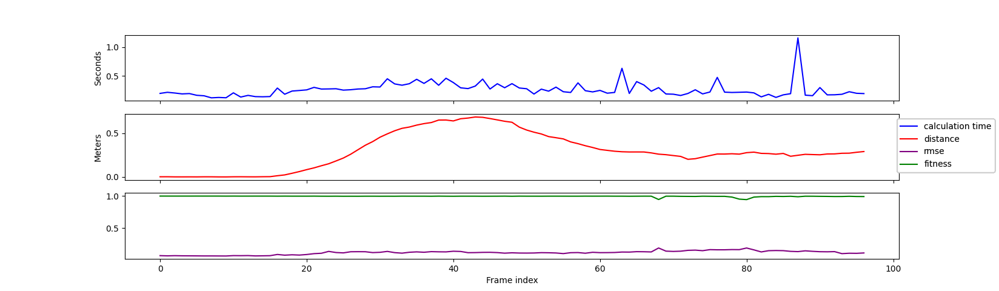
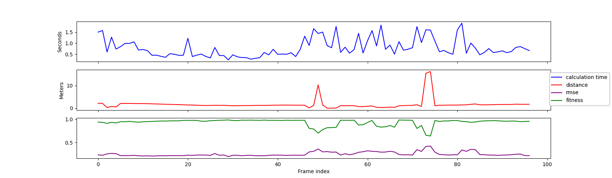
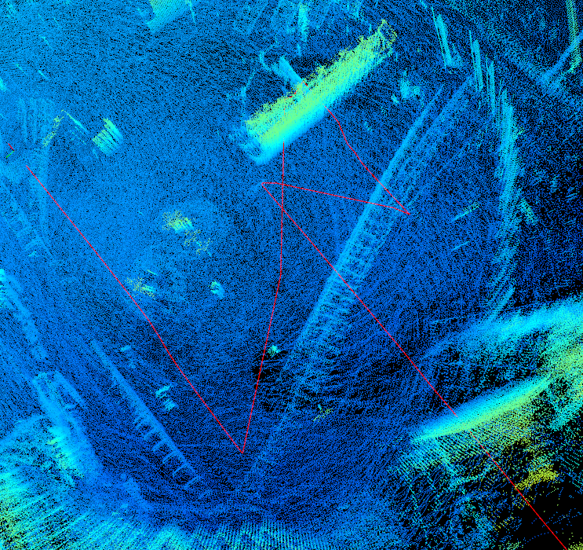
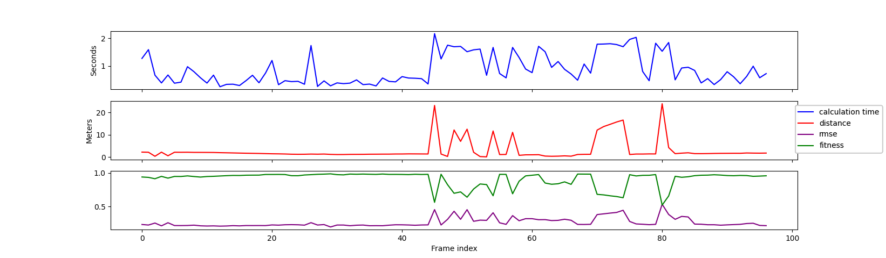
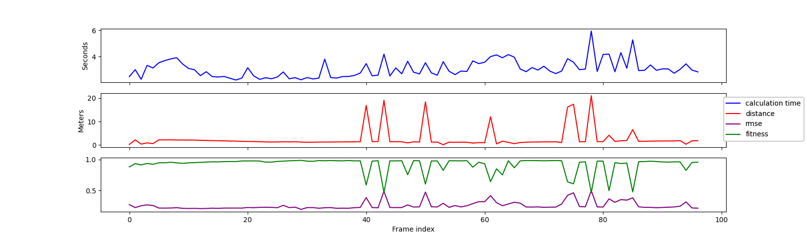
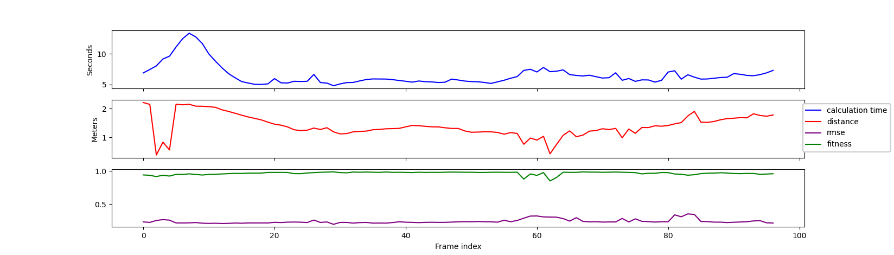

# Combine frames from a pcap file

This file documents testing the various registration algorithms on combining all frames from a pcap file.

All full file tests below are run on the file OS-1-128_992035000186_1024x10_20211005_134108.pcap, which is challenging as the vehicle drives through a roundabout at a speed that is high enough to make the frames much more different than in the above example.

## Baseline
As a baseline, the following table shows results from a very simple file (OS-1-128_992035000186_1024x10_20211005_134603.pcap), where the vehicle drives slowly into a parking house:



```
Number of frames:         97
Total movement distance:  28.6779
Max distance:              0.684275
Avg distance:              0.295649
Min distance:              0.000274826
Total time usage:         26.227
Max time:                  1.21472
Avg time:                  0.270382
Min time:                  0.121465
Max fitness:               0.998802
Avg fitness:               0.994665
Avg non-perfect fitness:   0.944652
Min fitness:               0.943838
Max rmse:                  0.190572
Avg rmse:                  0.118085
Min rmse:                  0.0658746
```

Fitness values are generally very high, probably due to small differences between sequential frames.

## Simple NICP



```
Number of frames:          97
Total movement distance:  166.931
Max distance:              16.1764
Avg distance:               1.72094
Min distance:               0.0304613
Total time usage:          76.5949
Max time:                   1.9045
Avg time:                   0.789638
Min time:                   0.242814
Max fitness:                0.98783
Avg fitness:                0.936683
Avg non-perfect fitness:    0.861167
Min fitness:                0.639967
Max rmse:                   0.4209
Avg rmse:                   0.249725
Min rmse:                   0.194038
```

As the plot shows, there are two large problem areas (around frame 50 and 75), with a hard part between them. Visually inspecting the combined cloud shows that it is severely misaligned multiple places, giving a poor driving route.



This indicates that a simple NICP may not be enough for frame sequences with larger differences.

## Downsampled first



```
Number of frames:          97
Total movement distance:  295.15
Max distance:              23.9721
Avg distance:               3.04278
Min distance:               0.0798747
Total time usage:          84.6971
Max time:                   2.1688
Avg time:                   0.873166
Min time:                   0.251571
Max fitness:                0.98783
Avg fitness:                0.910281
Avg non-perfect fitness:    0.797561
Min fitness:                0.521067
Max rmse:                   0.533298
Avg rmse:                   0.263508
Min rmse:                   0.194037
```

## Global registration first



```
Number of frames:          97
Total movement distance:  250.84
Max distance:              21.044
Avg distance:               2.58598
Min distance:               0.0854177
Total time usage:         298.831
Max time:                   5.95509
Avg time:                   3.08074
Min time:                   2.23277
Max fitness:                0.98783
Avg fitness:                0.918571
Avg non-perfect fitness:    0.789421
Min fitness:                0.466683
Max rmse:                   0.496163
Avg rmse:                   0.25713
Min rmse:                   0.19402
```

## Fast global registration first



```
Number of frames:          97
Total movement distance:  135.799
Max distance:               2.21431
Avg distance:               1.39999
Min distance:               0.38669
Total time usage:         631.784
Max time:                  13.3869
Avg time:                   6.51324
Min time:                   4.79481
Max fitness:                0.987845
Avg fitness:                0.965865
Avg non-perfect fitness:    0.926993
Min fitness:                0.850504
Max rmse:                   0.351993
Avg rmse:                   0.238573
Min rmse:                   0.194065
```