# Notes
Contains informal notes made during experimentation and development, as well as some plans for future work.

# Reading LIDAR data
The data used in the project are recorded using an Ouster lidar, which stores data as .pcap files with corresponding .json files containing sensor metadata. These files can be read using the [Ouster SDK](https://static.ouster.dev/sdk-docs/quickstart.html). This is done in `pcapReader.py`, whose `readFrame()` and `nextFrame()` functions returns a numpy array of points (which are numpy arrays of length 3; x, y and z).

Before lidar frames are used for point cloud registration, the vehicle is removed from the center of the frame, to avoid a always present stationary object messing with the registration algorithms.
```
vr = 2.5 # Vehicle radius
frame = frame[((frame[:, 0] > vr) | (frame[:, 0] < -vr)) | ((frame[:, 1] > vr) | (frame[:, 1] < -vr))]
```

# Reducing the number of points (downsampling)
As point clouds are rather large (usually at least a 100 000 points per frame), doing work on them can be time consuming. By reducing the number of points, we can speed up most calculations.

# Tracking movements between two LIDAR frames
In order to track movements between two LIDAR frames, we need to use some kind of feature matching to detect similar features in the two frames, and calculate how much they have moved.

## Methods
In the point cloud literature, it looks like [ICP (Iterative Closest Point)](https://en.wikipedia.org/wiki/Iterative_closest_point) registration is the way to go. The ICP registration algorithm "has been a mainstay of geometric registration in both research and industry for many years", according to the [open3d documentation](http://www.open3d.org/docs/release/tutorial/pipelines/icp_registration.html).

## Code libraries
During experimentation, we tested both [pyoints](https://github.com/laempy/pyoints)' ICP implementation, and open3d's [implementation](http://www.open3d.org/docs/release/tutorial/pipelines/icp_registration.html). Both libraries supports both ICP and NICP (which uses normals, or a point-to-plane objective function, to improve the convergence speed).

The table below shows some test results for ICP and NICP from Pyoints and Open3d. Note that Open3d's "point-to-point" corresponds to Pyoints' ICP, while "point-to-plane" corresponds to NICP. The maximum number of iterations was 100, and the convergence threshold was 0.001. Only Open3d reported fitness values. Open3d reported "inlier_rmse", while Pyoints reported "RMSE" -- they may not be comparable (according to visual comparisons of the matched frames, they are not). Open3d did not report the number of iterations used. The time usage for Open3d point-to-plane includes normal calculations, which seems to take well below 0.1 seconds per cloud (presumably depending on point count).

Original frames, which are misaligned with a few degrees:
[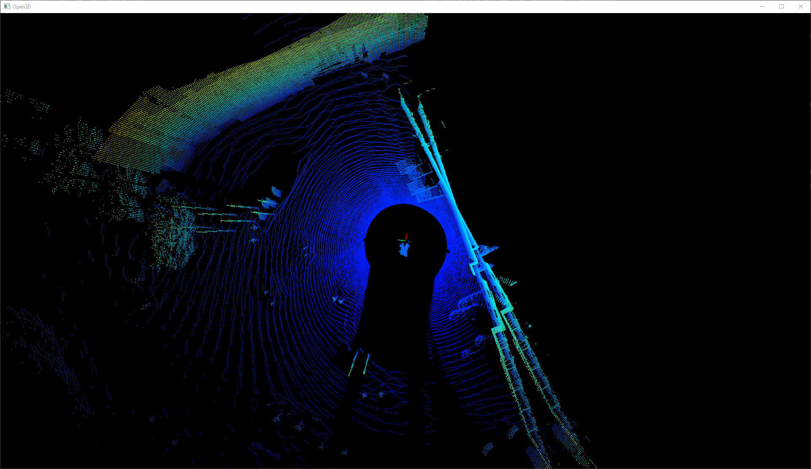](./frame-matching-test-frames.png)

| Function       | Downsampling | Iterations | Time usage | RMSE    | Fitness | Movement (xyz)    | Aligned frames |
|----------------|--------------|------------|------------|---------|---------|-------------------|-------|
| Pyoints ICP    | No           | 60         | 200.6 s    | 0.0025  | -       | 0.68, 0.19, 0.03  |[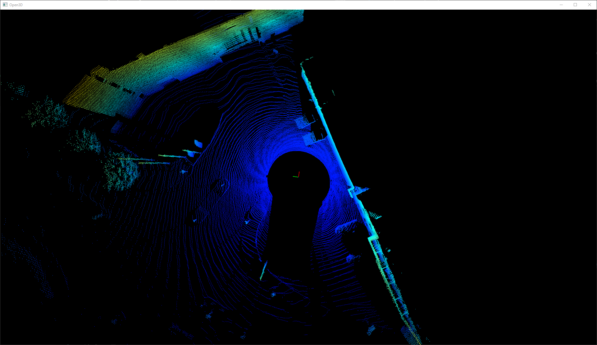](./frame-matching-pyoints-icp-0.png)
| Pyoints NICP   | No           | 46         | 173.5 s    | 0.0019  | -       | 0.65, 0.19, 0.02  |[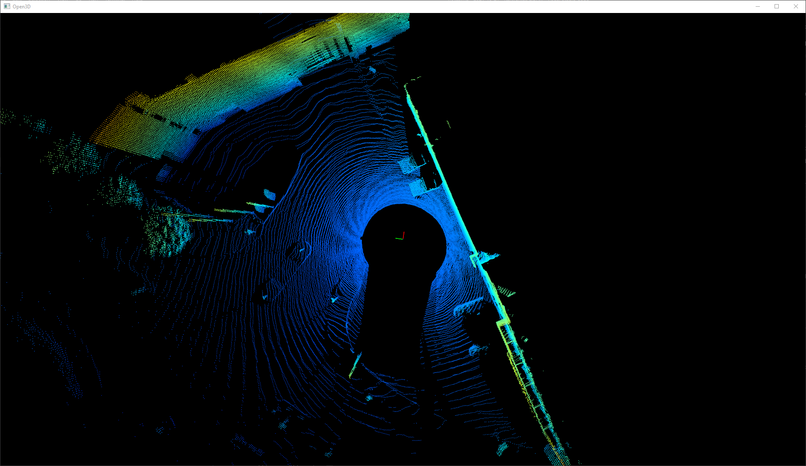](./frame-matching-pyoints-nicp-0.png)
| Pyoints ICP    | 0.5          | 85         | 65.4 s     | 0.0025  | -       | 0.69, 0.20, 0.04  |[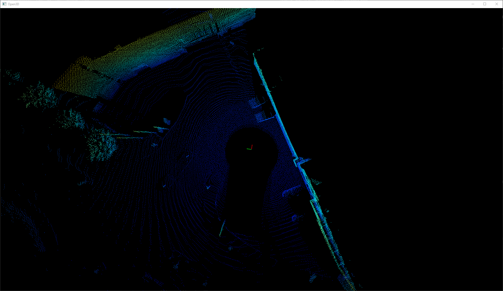](./frame-matching-pyoints-icp-0,5.png)
| Pyoints NICP   | 0.5          | 48         | 9.7 s      | 0.0026  | -       | 0.70, 0.17, 0.04  |[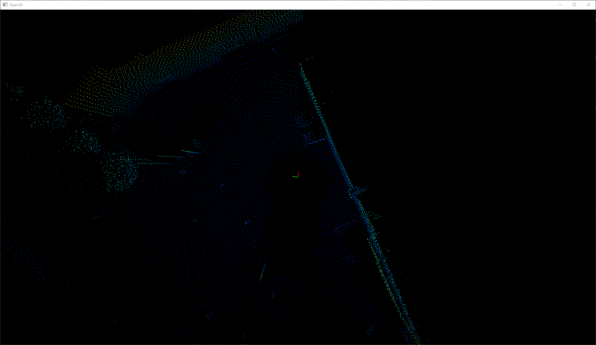](./frame-matching-pyoints-nicp-0,5.png)
| Open3d p2point | No           | -          | 1.1 s      | 0.1554  | 0.9914  | 0.64, 0.12, 0.04  |[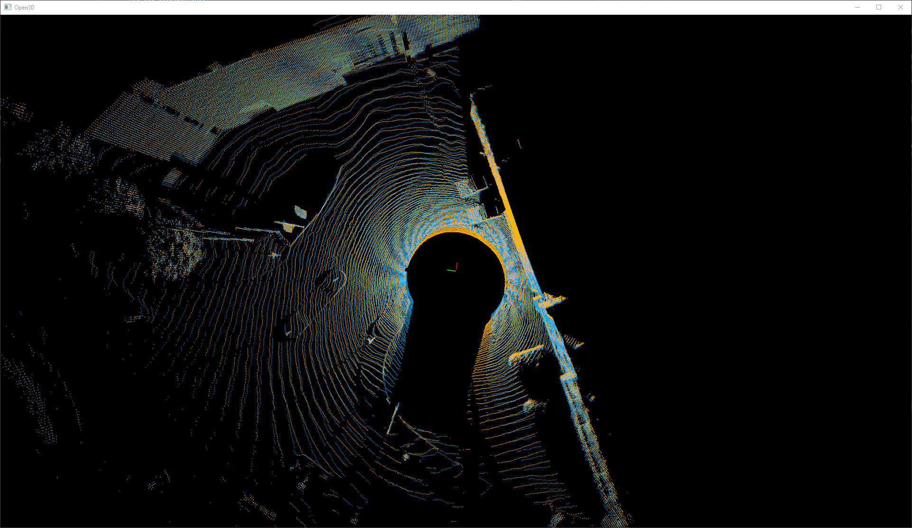](./frame-matching-open3d-icp-0.png)
| Open3d p2plane | No           | -          | 0.8 s      | 0.1521  | 0.9908  | 0.68, 0.15, 0.04  |[](./frame-matching-open3d-nicp-0.png)
| Open3d p2point | 0.5          | -          | 0.07 s     | 0.3106  | 0.9486  | 0.70, 0.16, 0.02  |[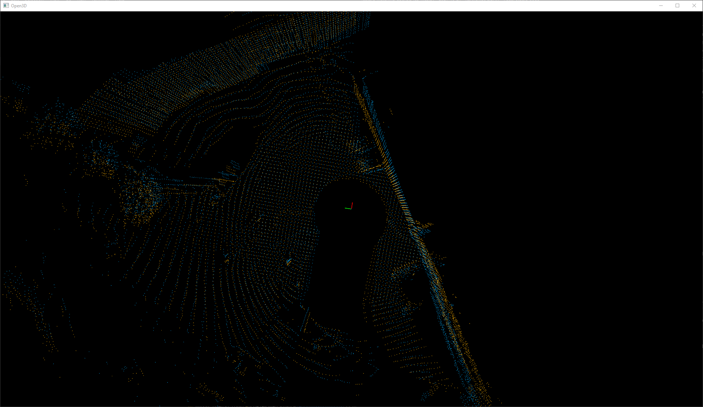](./frame-matching-open3d-icp-0,5.png)
| Open3d p2plane | 0.5          | -          | 0.04 s     | 0.4903  | 0.5726  | 0.00, 0.00, 0.03  |[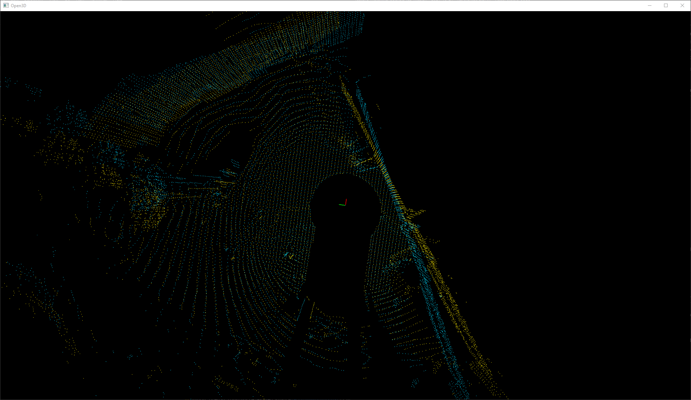](./frame-matching-open3d-nicp-0,5.png)

The table below shows a single downsampling test per library (performed on the source cloud from the matching test above).

| Library | Radius | Time usage  | Downsampled cloud |
|---------|--------|-------------|-------------------|
| Pyoints | 0.5    | 0.3892 s    | [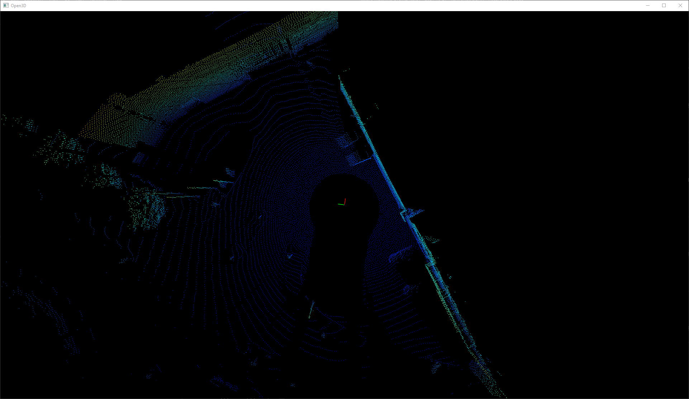](./downsampling-pyoints-0,5.png)
| Open3d  | 0.5    | 0.0067 s    | [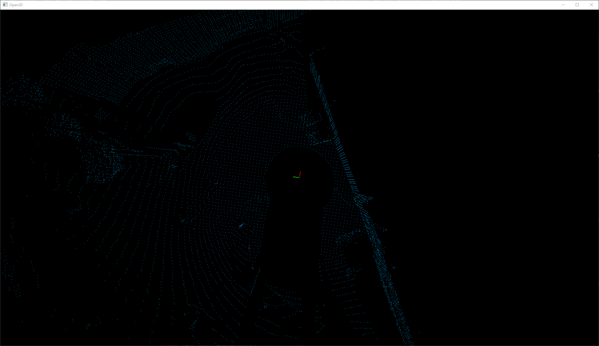](./downsampling-open3d-0,5.png)

As Open3d was faster, easier to work with, and regularly maintained, it was chosen over Pyoints in this project.

## Pipeline
There are multiple alternatives on how to perform movement tracking between two frames.

* Simple NICP between two sequential frames, then calculate movement using the transformation.
* Downsampled NICP to generate initial transformation, then a faster NICP run for more exact transformation.
* [Global registration](http://www.open3d.org/docs/release/tutorial/pipelines/global_registration.html) to generate initial transformation, then a faster NICP run for more exact transformation.
* Using [multiway registration](http://www.open3d.org/docs/latest/tutorial/pipelines/multiway_registration.html) to do all the work.

This section will document experiments investigating the different alternatives.

| Function          | Time usage | RMSE    | Fitness   | Movement (xyz)    | Aligned frames |
|-------------------|------------|---------|-----------|-------------------|-------|
| Simple NICP       | 0.6954 s   | 0.1521  | 0.990773  | 0.68, 0.15, 0.04  |[](./frame-matching-open3d-nicp-0.png)
| Downsampled first | 0.6574 s   | 0.1521  | 0.990773  | 0.68, 0.15, 0.04  |[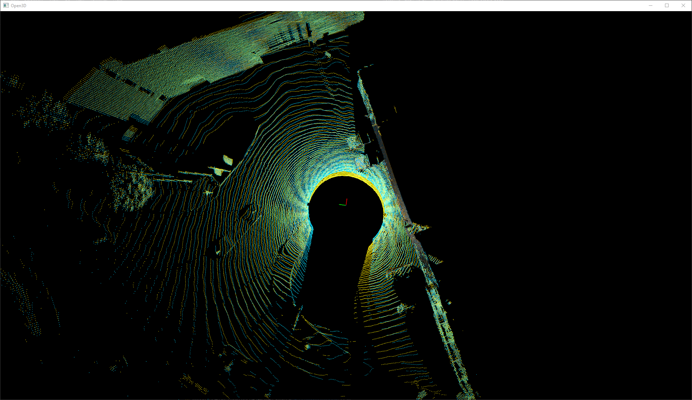](./pipeline-downsampling-first.png)
| Global reg. first | 3.2391 s   | 0.1521  | 0.990773  | 0.68, 0.15, 0.04  |[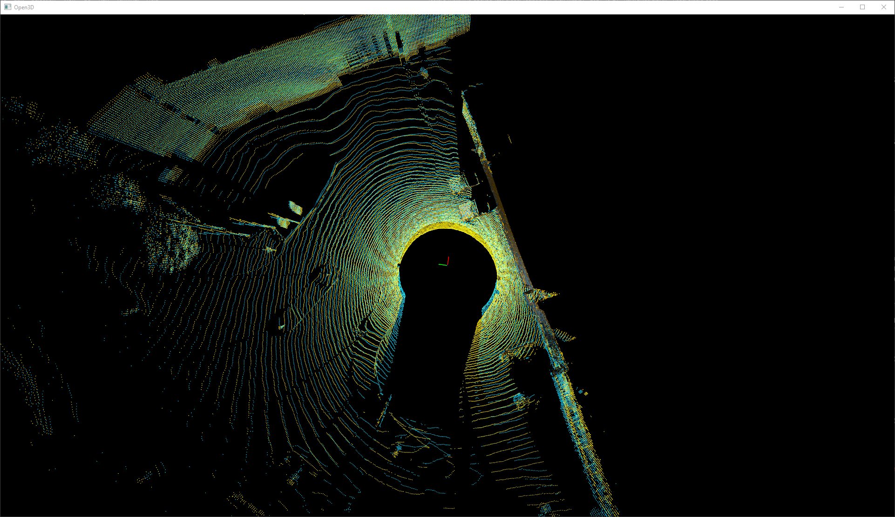](./pipeline-global-registration-first.png)
| Fast global reg. first | 7.5359 s   | 0.1521  | 0.990751  | 0.68, 0.15, 0.04  |[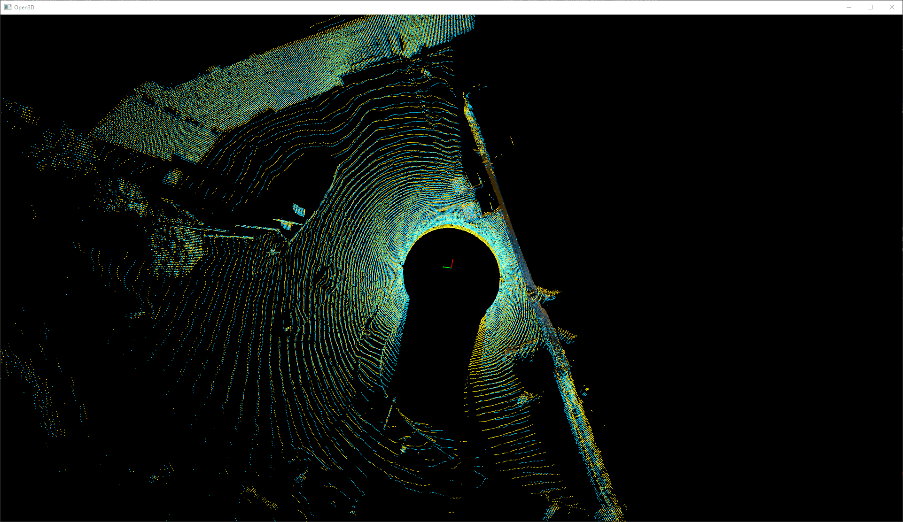](./pipeline-fast-global-registration-first.png)

Both using downsampled NICP registration and global registration to generate initial transformation seems to be very unneccessary with these frames. Probably because the point clouds change so little from frame to frame.

Recall that the table above is based on a single registration between two very similar frames. Below follows a more thorough test of an entire pcap file.

| Function          | Time usage | Avg. RMSE | Avg. fitness | Min fitness |  Total distance |
|-------------------|------------|-----------|--------------|-------------|-----------------|
| Baseline          | 26.227 s   | 0.118085  | 0.994665     | 0.943838    | 28.6779         |
| Simple NICP       | 76.595 s   | 0.249725  | 0.936683     | 0.639967    | 166.931         |
| Downsampled first | 84.697 s   | 0.263508  | 0.910281     | 0.521067    | 295.15         |
| Global reg. first | 298.83 s   | 0.25713  | 0.918571     | 0.466683    | 250.84         |
| Fast global reg. first | 631.78 s   | 0.238573  | 0.965865     | 0.850504    | 135.799         |

[See the full details here.](./full-file-matching.md)

## Parameters
TODO: Test and decide parameters for matching function.

## Usage
Two sequential frames are aligned using Open3d's point-to-plane function. The two point clouds are transformed using the resulting transformation, then merged together to a single point cloud, and then downsampled with a tiny radius to avoid too much point growth.

For each pair of merged lidar frames, a spatial movement can be calculated. This movement is aggregated over the entire .pcap file, resulting in a 3D path through the generated point cloud.

# Problems

## Pyoints
Pyoints had some dependencies that were hard to install, including GDAL and Pyproj (which made issues for ouster-sdk). Therefore, the version that was in the repo was a stripped down version of the Pyoints source, with references to GDAL, OpenCV and Pyproj removed.

As open3d was chosen over Pyoints, all Pyoints source code was eventually removed from the repository.

## Pyproj
When installing Pyproj in the environment, the ouster-sdk stops working. It has therefore been avoided.