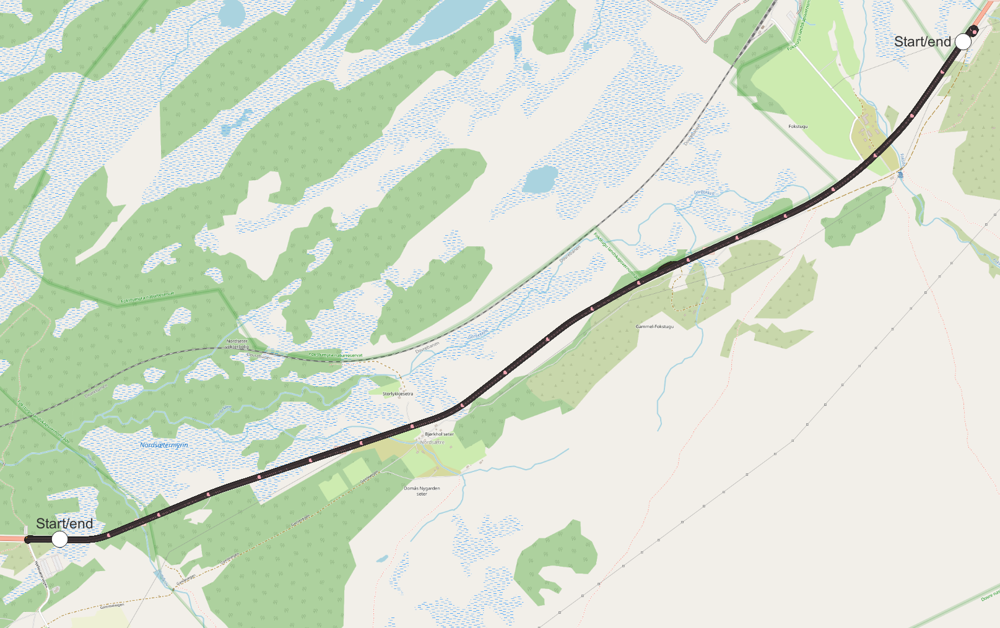

#### Table of Contents
* [Dovre](#header)
  * [The collected datasets](#datasets)
    * [October 21th 2021 (without snow)](#2021)
    * [February 16th 2022 (with snow)](#2022)
  * [Point clouds](#pointclouds)
* [The analysis](#analysis)
  * [Details](#details)
  * [Absolute navigation](#analysis-abs)
  * [Incremental navigation](#analysis-inc)
* [Run configs](#run-configs)
  * [Absolute, PCAPs from 2021, point cloud from 2021](#abs-pcap2021-pc2021)
  * [Absolute, PCAPs from 2021, point cloud from 2022](#abs-pcap2021-pc2022)
  * [Absolute, PCAPs from 2022, point cloud from 2021](#abs-pcap2022-pc2021)
  * [Absolute, PCAPs from 2022, point cloud from 2022](#abs-pcap2022-pc2022)
  * [Incremental, PCAPs from 2021](#inc-pcap2021)
  * [Incremental, PCAPs from 2022](#inc-pcap2022)

<a name="header"></a>
# Dovre

<a name="datasets"></a>
## The collected datasets

<a name="2021"></a>
### October 21th 2021 (without snow):
| Trip# | Direction | Frequency | Start time | Comment |
|-------|-----------|-----------|------------|---------|
| 1     | West-East | 20 hz     | 17:15      | OK      |
| 2     | East-West | 20 hz     | 17:24      | OK      |
| 3     | West-East | 20 hz     | 17:35      | OK      |
| 4     | East-West | 20 hz     | 17:46      | OK      |
| 5     | West-East | 20 hz     | 17:54      | OK      |
| 6     | East-West | 20 hz     | 18:02      | OK      |
| 7     | West-East | 10 hz     | 18:11      | OK      |
| 8     | East-West | 10 hz     | 18:21      | OK      |
| 9     | West-East | 10 hz     | 18:29      | OK      |
| 10    | East-West | 10 hz     | 18:38      | OK      |


<a name="2022"></a>
### February 26th and 27th 2022 (with snow):
| Trip# | Direction | Frequency | Start time | Comment |
|-------|-----------|-----------|------------|---------|
| 1     | West-East | 10 hz     | 09:35      | OK      |
| 2     | East-West | 10 hz     | 09:43      | OK      |
| 3     | West-East | 10 hz     | 09:53      | OK      |
| 4     | East-West | 10 hz     | 10:00      | OK      |
| 5     | East-West | 20 hz     | 10:25      | OK      |
| 6     | West-East | 20 hz     | 10:35      | OK      |
| 7     | East-West | 20 hz     | 10:42      | OK      |
| 8     | West-East | 20 hz     | 09:55      | OK      |
| 9     | East-West | 20 hz     | 10:04      | OK      |
| 10    | West-East | 20 hz     | 10:14      | OK      |

The last three trips in 2022 were recorded on the next day (the 27th). From the day before, there was now 10cm more snow on the ground, and a bit snow in the air.

The image below shows the driving route on a map of Lillehammer. All 10 valid trips are drawn, but as they are very similar, it's hard to differentiate them in this plot.
The trips are recorded in both directions; the two white circles show the analysis start or end points depending on which direction the trip is. 



<a name="pointclouds"></a>
# Point clouds
The point clouds are generated from trip 1 in 2021 and trip 1 in 2022 by the NMA. The resulting .laz files are merged into one using the following commands:
```
python pointCloud.py --create-from "validation\Dovre\2021-10-20\pointcloud" --write-to "validation\Dovre\2021-10-20\pointcloud\combined_100.pcd" --voxel-size 0.1
python pointCloud.py --create-from "validation\Dovre\2022-01-26\pointcloud" --write-to "validation\Dovre\2022-01-26\pointcloud\combined_100.pcd" --voxel-size 0.1
```

<a name="analysis"></a>
# The analysis

<a name="details"></a>
## Details

This section is about Dovre specifically. See [this document](./../../_notes/summary.md) for more method details that are common for all four locations.

To make the results comparable, the trip analyses all started at the same point. This point is indicated with the white circle on the image above. The analyses ran until failure, or until the actual position reached the end circle.

**Common command line arguments:**

Differs by trip direction. Command line arguments are identical except for switched skip-until and run-until arguments.

West-East:
```
{
    "preview": "always",
    "build-cloud-after": 5,
    "skip-until-x": 515453.627,
    "skip-until-y": 6887374.395,
    "run-until-x": 510862.556,
    "run-until-y": 6884823.316,
    "recreate-caches": true,
    "max-frame-radius": 25,
    "wait-after-first-frame": 15,
    "hide-point-cloud": true,
    "save-after-first-frame": true,
    "save-after-frames": 50,
    "raise-on-2d-error": 25,
    "raise-on-3d-error": 50,
    "sbet-crs-from": 4937,
    "sbet-crs-to": 5972,
    "use-actual-coordinate": false,
    "voxel-size": 0.1
}
```

East-West:
```
{
    "preview": "always",
    "build-cloud-after": 5,
    "skip-until-x": 510862.556,
    "skip-until-y": 6884823.316,
    "run-until-x": 515453.627,
    "run-until-y": 6887374.395,
    "recreate-caches": true,
    "max-frame-radius": 25,
    "wait-after-first-frame": 15,
    "hide-point-cloud": true,
    "save-after-first-frame": true,
    "save-after-frames": 50,
    "raise-on-2d-error": 25,
    "raise-on-3d-error": 50,
    "sbet-crs-from": 4937,
    "sbet-crs-to": 5972,
    "use-actual-coordinate": false,
    "voxel-size": 0.1
}
```

<a name="analysis-abs"></a>
## Absolute navigation

The absolute navigation tables show how well the navigation worked in each of the four weather situations:
 - Bare/Bare means that the trips from 2021 (without snow) are run against the point cloud from 2021 (without snow).
 - Bare/Snow means that the trips from 2021 (without snow) are run against the point cloud from 2022 (with snow).
 - Snow/Bare means that the trips from 2022 (with snow) are run against the point cloud from 2021 (without snow).
 - Snow/Snow means that the trips from 2022 (with snow) are run against the point cloud from 2022 (with snow).

The numbers in the four results column represents the results for that combination, and are explained before each of the tables. Letters in those columns mean:
- N/A: This trip does not exist in this source material.
- N/P: This trip has not yet been processed.

_**Meters driven before failure**_
| Trip#   | Bare/Bare | Bare/Snow | Snow/Bare | Snow/Snow |
|---------|-----------|-----------|-----------|-----------|
| 1     | 750.122 | 237.152 | 68.292 | 1,194.612 |
| 2     | 354.472 | 363.579 | 66.531 | 1,285.562 |
| 3     | 948.368 | 701.426 | 62.822 | 717.829 |
| 4     | 729.602 | 650.683 | 65.605 | 416.288 |
| 5     | 1,115.347 | 645.548 | 67.354 | 437.997 |
| 6     | 131.454 | 3.630 | 38.962 | 34.943 |
| 7     | 137.249 | 31.333 | 33.302 | 90.932 |
| 8     | 129.995 | 6.318 | 5.722 | 257.396 |
| 9     | 35.433 | 10.363 | 33.453 | 745.076 |
| 10     | 41.996 | 17.603 | 35.603 | 99.248 |
| **Average** | **437.404** | **266.763** | **47.765** | **527.988** |


_**Percentage of route driven before failure**_
| Trip#   | Bare/Bare | Bare/Snow | Snow/Bare | Snow/Snow |
|---------|-----------|-----------|-----------|-----------|
| 1     | 20.3 | 6.4 | 1.8 | 32.3 |
| 2     | 9.6 | 9.8 | 1.8 | 34.7 |
| 3     | 25.6 | 19.0 | 1.7 | 19.4 |
| 4     | 19.7 | 17.6 | 1.8 | 11.3 |
| 5     | 30.1 | 17.4 | 1.8 | 11.8 |
| 6     | 3.6 | 0.1 | 1.1 | 0.9 |
| 7     | 3.7 | 0.8 | 0.9 | 2.5 |
| 8     | 3.5 | 0.2 | 0.2 | 7.0 |
| 9     | 1.0 | 0.3 | 0.9 | 20.1 |
| 10     | 1.1 | 0.5 | 1.0 | 2.7 |
| **Average** | **11.8** | **7.2** | **1.3** | **14.3** |


_**2D difference between actual and estimated coordinates [M]**_
| Trip#   | Bare/Bare | Bare/Snow | Snow/Bare | Snow/Snow |
|---------|-----------|-----------|-----------|-----------|
| 1     | 1.602 | 1.184 | 2.637 | 1.942 |
| 2     | 1.027 | 1.275 | 2.435 | 1.313 |
| 3     | 1.516 | 1.249 | 1.764 | 1.480 |
| 4     | 2.107 | 1.471 | 1.860 | 1.047 |
| 5     | 1.882 | 1.405 | 1.810 | 1.470 |
| 6     | 5.207 | 9.594 | 5.039 | 7.523 |
| 7     | 4.413 | 3.558 | 6.236 | 14.662 |
| 8     | 5.013 | 9.293 | 9.827 | 1.481 |
| 9     | 4.640 | 8.550 | 10.531 | 1.052 |
| 10     | 7.297 | 13.123 | 9.905 | 5.564 |
| **Average** | **3.470** | **5.070** | **5.204** | **3.753** |


_**3D difference between actual and estimated coordinates [M]**_
| Trip#   | Bare/Bare | Bare/Snow | Snow/Bare | Snow/Snow |
|---------|-----------|-----------|-----------|-----------|
| 1     | 1.607 | 5.914 | 2.728 | 5.501 |
| 2     | 1.036 | 5.716 | 2.532 | 5.166 |
| 3     | 1.528 | 5.434 | 1.893 | 5.741 |
| 4     | 2.114 | 5.549 | 1.982 | 5.262 |
| 5     | 1.891 | 5.507 | 2.014 | 5.745 |
| 6     | 5.212 | 12.029 | 5.134 | 10.038 |
| 7     | 4.418 | 7.836 | 6.252 | 16.137 |
| 8     | 5.017 | 11.850 | 9.855 | 6.169 |
| 9     | 4.646 | 11.159 | 10.549 | 5.721 |
| 10     | 7.301 | 14.996 | 9.919 | 8.311 |
| **Average** | **3.477** | **8.599** | **5.286** | **7.379** |


_**Reported registration fitness**_
| Trip#   | Bare/Bare | Bare/Snow | Snow/Bare | Snow/Snow |
|---------|-----------|-----------|-----------|-----------|
| 1     | 0.784 | 0.987 | 0.806 | 0.994 |
| 2     | 0.797 | 0.982 | 0.806 | 0.995 |
| 3     | 0.770 | 0.993 | 0.837 | 0.992 |
| 4     | 0.752 | 0.992 | 0.837 | 0.990 |
| 5     | 0.755 | 0.991 | 0.827 | 0.976 |
| 6     | 0.701 | 0.846 | 0.748 | 0.980 |
| 7     | 0.746 | 0.997 | 0.785 | 0.971 |
| 8     | 0.727 | 0.845 | 0.659 | 0.996 |
| 9     | 0.782 | 0.869 | 0.758 | 0.998 |
| 10     | 0.772 | 0.912 | 0.769 | 0.986 |
| **Average** | **0.759** | **0.941** | **0.783** | **0.988** |


_**Reported registration RMSE**_
| Trip#   | Bare/Bare | Bare/Snow | Snow/Bare | Snow/Snow |
|---------|-----------|-----------|-----------|-----------|
| 1     | 0.183 | 0.181 | 0.269 | 0.115 |
| 2     | 0.194 | 0.190 | 0.273 | 0.107 |
| 3     | 0.184 | 0.185 | 0.259 | 0.133 |
| 4     | 0.210 | 0.190 | 0.261 | 0.147 |
| 5     | 0.195 | 0.194 | 0.267 | 0.156 |
| 6     | 0.267 | 0.321 | 0.309 | 0.149 |
| 7     | 0.239 | 0.141 | 0.282 | 0.178 |
| 8     | 0.249 | 0.291 | 0.311 | 0.071 |
| 9     | 0.216 | 0.349 | 0.354 | 0.074 |
| 10     | 0.216 | 0.373 | 0.289 | 0.142 |
| **Average** | **0.215** | **0.241** | **0.287** | **0.127** |


_**Registration iterations before convergence**_
| Trip#   | Bare/Bare | Bare/Snow | Snow/Bare | Snow/Snow |
|---------|-----------|-----------|-----------|-----------|
| 1     | 177.225 | 110.262 | 204.412 | 96.756 |
| 2     | 167.534 | 108.161 | 203.723 | 89.397 |
| 3     | 175.996 | 94.775 | 196.875 | 82.676 |
| 4     | 185.949 | 103.344 | 187.500 | 88.248 |
| 5     | 188.094 | 107.709 | 196.579 | 94.333 |
| 6     | 203.631 | 196.429 | 210.000 | 184.259 |
| 7     | 194.724 | 117.273 | 222.917 | 168.359 |
| 8     | 198.565 | 220.833 | 241.667 | 68.417 |
| 9     | 203.226 | 215.000 | 177.041 | 69.934 |
| 10     | 218.056 | 218.750 | 202.404 | 161.458 |
| **Average** | **191.300** | **149.254** | **204.312** | **110.384** |


_**LiDAR Frequency**_
| Trip#   | Bare/Bare | Bare/Snow | Snow/Bare | Snow/Snow |
|---------|-----------|-----------|-----------|-----------|
| 1     | 20 hz | 20 hz | 10 hz | 10 hz |
| 2     | 20 hz | 20 hz | 10 hz | 10 hz |
| 3     | 20 hz | 20 hz | 20 hz | 20 hz |
| 4     | 10 hz | 10 hz | 20 hz | 20 hz |
| 5     | 10 hz | 10 hz | 20 hz | 20 hz |
| 6     | 20 hz | 20 hz | 10 hz | 10 hz |
| 7     | 20 hz | 20 hz | 10 hz | 10 hz |
| 8     | 20 hz | 20 hz | 20 hz | 20 hz |
| 9     | 10 hz | 10 hz | 20 hz | 20 hz |
| 10     | 10 hz | 10 hz | 20 hz | 20 hz |


_**Links to individual trip details**_
| Trip#   | Bare/Bare | Bare/Snow | Snow/Bare | Snow/Snow |
|---------|-----------|-----------|-----------|-----------|
| 1     | [Link](./ABS%2C%20PCAP2021%2C%20PC2021/1_ned_20hz) | [Link](./ABS%2C%20PCAP2021%2C%20PC2022/1_ned_20hz) | [Link](./ABS%2C%20PCAP2022%2C%20PC2021/2_nordover_10hz) | [Link](./ABS%2C%20PCAP2022%2C%20PC2022/2_nordover_10hz) |
| 2     | [Link](./ABS%2C%20PCAP2021%2C%20PC2021/2_ned_20hz) | [Link](./ABS%2C%20PCAP2021%2C%20PC2022/2_ned_20hz) | [Link](./ABS%2C%20PCAP2022%2C%20PC2021/4_nordover_10hz) | [Link](./ABS%2C%20PCAP2022%2C%20PC2022/4_nordover_10hz) |
| 3     | [Link](./ABS%2C%20PCAP2021%2C%20PC2021/3_ned_20hz) | [Link](./ABS%2C%20PCAP2021%2C%20PC2022/3_ned_20hz) | [Link](./ABS%2C%20PCAP2022%2C%20PC2021/5_nordover_20hz) | [Link](./ABS%2C%20PCAP2022%2C%20PC2022/5_nordover_20hz) |
| 4     | [Link](./ABS%2C%20PCAP2021%2C%20PC2021/4_ned_10hz) | [Link](./ABS%2C%20PCAP2021%2C%20PC2022/4_ned_10hz) | [Link](./ABS%2C%20PCAP2022%2C%20PC2021/7_nordover_20hz) | [Link](./ABS%2C%20PCAP2022%2C%20PC2022/7_nordover_20hz) |
| 5     | [Link](./ABS%2C%20PCAP2021%2C%20PC2021/5_ned_10hz) | [Link](./ABS%2C%20PCAP2021%2C%20PC2022/5_ned_10hz) | [Link](./ABS%2C%20PCAP2022%2C%20PC2021/9_nordover_20hz) | [Link](./ABS%2C%20PCAP2022%2C%20PC2022/9_nordover_20hz) |
| 6     | [Link](./ABS%2C%20PCAP2021%2C%20PC2021/1_opp_20hz) | [Link](./ABS%2C%20PCAP2021%2C%20PC2022/1_opp_20hz) | [Link](./ABS%2C%20PCAP2022%2C%20PC2021/1_sorover_10hz) | [Link](./ABS%2C%20PCAP2022%2C%20PC2022/1_sorover_10hz) |
| 7     | [Link](./ABS%2C%20PCAP2021%2C%20PC2021/2_opp_20hz) | [Link](./ABS%2C%20PCAP2021%2C%20PC2022/2_opp_20hz) | [Link](./ABS%2C%20PCAP2022%2C%20PC2021/3_sorover_10hz) | [Link](./ABS%2C%20PCAP2022%2C%20PC2022/3_sorover_10hz) |
| 8     | [Link](./ABS%2C%20PCAP2021%2C%20PC2021/3_opp_20hz) | [Link](./ABS%2C%20PCAP2021%2C%20PC2022/3_opp_20hz) | [Link](./ABS%2C%20PCAP2022%2C%20PC2021/6_sorover_20hz) | [Link](./ABS%2C%20PCAP2022%2C%20PC2022/6_sorover_20hz) |
| 9     | [Link](./ABS%2C%20PCAP2021%2C%20PC2021/4_opp_10hz) | [Link](./ABS%2C%20PCAP2021%2C%20PC2022/4_opp_10hz) | [Link](./ABS%2C%20PCAP2022%2C%20PC2021/8_sorover_20hz) | [Link](./ABS%2C%20PCAP2022%2C%20PC2022/8_sorover_20hz) |
| 10     | [Link](./ABS%2C%20PCAP2021%2C%20PC2021/5_opp_10hz) | [Link](./ABS%2C%20PCAP2021%2C%20PC2022/5_opp_10hz) | [Link](./ABS%2C%20PCAP2022%2C%20PC2021/10_sorover_20hz) | [Link](./ABS%2C%20PCAP2022%2C%20PC2022/10_sorover_20hz) |

<a name="analysis-inc"></a>
## Incremental navigation
[Not run.]

<a name="run-configs"></a>
## Run configurations

<a name="abs-pcap2021-pc2021"></a>
### Absolute, PCAPs from 2021, point cloud from 2021

```
python absoluteNavigator.py --pcap "validation\Dovre\2021-10-20\pcap\1_ned_20hz" --sbet "validation\Dovre\2021-10-20\navigation\sbet-output-UTC-1000.out" --point-cloud "validation\Dovre\2021-10-20\pointcloud\combined_100.pcd" --save-to "validation\Dovre\results\ABS, PCAP2021, PC2021\1_ned_20hz" --load-arguments "validation\Dovre\default-arguments.json"
python absoluteNavigator.py --pcap "validation\Dovre\2021-10-20\pcap\1_opp_20hz" --sbet "validation\Dovre\2021-10-20\navigation\sbet-output-UTC-1000.out" --point-cloud "validation\Dovre\2021-10-20\pointcloud\combined_100.pcd" --save-to "validation\Dovre\results\ABS, PCAP2021, PC2021\1_opp_20hz" --load-arguments "validation\Dovre\default-arguments-reversed.json"
python absoluteNavigator.py --pcap "validation\Dovre\2021-10-20\pcap\2_ned_20hz" --sbet "validation\Dovre\2021-10-20\navigation\sbet-output-UTC-1000.out" --point-cloud "validation\Dovre\2021-10-20\pointcloud\combined_100.pcd" --save-to "validation\Dovre\results\ABS, PCAP2021, PC2021\2_ned_20hz" --load-arguments "validation\Dovre\default-arguments.json"
python absoluteNavigator.py --pcap "validation\Dovre\2021-10-20\pcap\2_opp_20hz" --sbet "validation\Dovre\2021-10-20\navigation\sbet-output-UTC-1000.out" --point-cloud "validation\Dovre\2021-10-20\pointcloud\combined_100.pcd" --save-to "validation\Dovre\results\ABS, PCAP2021, PC2021\2_opp_20hz" --load-arguments "validation\Dovre\default-arguments-reversed.json"
python absoluteNavigator.py --pcap "validation\Dovre\2021-10-20\pcap\3_ned_20hz" --sbet "validation\Dovre\2021-10-20\navigation\sbet-output-UTC-1000.out" --point-cloud "validation\Dovre\2021-10-20\pointcloud\combined_100.pcd" --save-to "validation\Dovre\results\ABS, PCAP2021, PC2021\3_ned_20hz" --load-arguments "validation\Dovre\default-arguments.json"
python absoluteNavigator.py --pcap "validation\Dovre\2021-10-20\pcap\3_opp_20hz" --sbet "validation\Dovre\2021-10-20\navigation\sbet-output-UTC-1000.out" --point-cloud "validation\Dovre\2021-10-20\pointcloud\combined_100.pcd" --save-to "validation\Dovre\results\ABS, PCAP2021, PC2021\3_opp_20hz" --load-arguments "validation\Dovre\default-arguments-reversed.json"
python absoluteNavigator.py --pcap "validation\Dovre\2021-10-20\pcap\4_ned_10hz" --sbet "validation\Dovre\2021-10-20\navigation\sbet-output-UTC-1000.out" --point-cloud "validation\Dovre\2021-10-20\pointcloud\combined_100.pcd" --save-to "validation\Dovre\results\ABS, PCAP2021, PC2021\4_ned_10hz" --load-arguments "validation\Dovre\default-arguments.json"
python absoluteNavigator.py --pcap "validation\Dovre\2021-10-20\pcap\4_opp_10hz" --sbet "validation\Dovre\2021-10-20\navigation\sbet-output-UTC-1000.out" --point-cloud "validation\Dovre\2021-10-20\pointcloud\combined_100.pcd" --save-to "validation\Dovre\results\ABS, PCAP2021, PC2021\4_opp_10hz" --load-arguments "validation\Dovre\default-arguments-reversed.json"
python absoluteNavigator.py --pcap "validation\Dovre\2021-10-20\pcap\5_ned_10hz" --sbet "validation\Dovre\2021-10-20\navigation\sbet-output-UTC-1000.out" --point-cloud "validation\Dovre\2021-10-20\pointcloud\combined_100.pcd" --save-to "validation\Dovre\results\ABS, PCAP2021, PC2021\5_ned_10hz" --load-arguments "validation\Dovre\default-arguments.json"
python absoluteNavigator.py --pcap "validation\Dovre\2021-10-20\pcap\5_opp_10hz" --sbet "validation\Dovre\2021-10-20\navigation\sbet-output-UTC-1000.out" --point-cloud "validation\Dovre\2021-10-20\pointcloud\combined_100.pcd" --save-to "validation\Dovre\results\ABS, PCAP2021, PC2021\5_opp_10hz" --load-arguments "validation\Dovre\default-arguments-reversed.json"
```

<a name="abs-pcap2021-pc2022"></a>
### Absolute, PCAPs from 2021, point cloud from 2022

```
python absoluteNavigator.py --pcap "validation\Dovre\2021-10-20\pcap\1_ned_20hz" --sbet "validation\Dovre\2021-10-20\navigation\sbet-output-UTC-1000.out" --point-cloud "validation\Dovre\2022-01-26\pointcloud\combined_100.pcd" --save-to "validation\Dovre\results\ABS, PCAP2021, PC2022\1_ned_20hz" --load-arguments "validation\Dovre\default-arguments.json"
python absoluteNavigator.py --pcap "validation\Dovre\2021-10-20\pcap\1_opp_20hz" --sbet "validation\Dovre\2021-10-20\navigation\sbet-output-UTC-1000.out" --point-cloud "validation\Dovre\2022-01-26\pointcloud\combined_100.pcd" --save-to "validation\Dovre\results\ABS, PCAP2021, PC2022\1_opp_20hz" --load-arguments "validation\Dovre\default-arguments-reversed.json"
python absoluteNavigator.py --pcap "validation\Dovre\2021-10-20\pcap\2_ned_20hz" --sbet "validation\Dovre\2021-10-20\navigation\sbet-output-UTC-1000.out" --point-cloud "validation\Dovre\2022-01-26\pointcloud\combined_100.pcd" --save-to "validation\Dovre\results\ABS, PCAP2021, PC2022\2_ned_20hz" --load-arguments "validation\Dovre\default-arguments.json"
python absoluteNavigator.py --pcap "validation\Dovre\2021-10-20\pcap\2_opp_20hz" --sbet "validation\Dovre\2021-10-20\navigation\sbet-output-UTC-1000.out" --point-cloud "validation\Dovre\2022-01-26\pointcloud\combined_100.pcd" --save-to "validation\Dovre\results\ABS, PCAP2021, PC2022\2_opp_20hz" --load-arguments "validation\Dovre\default-arguments-reversed.json"
python absoluteNavigator.py --pcap "validation\Dovre\2021-10-20\pcap\3_ned_20hz" --sbet "validation\Dovre\2021-10-20\navigation\sbet-output-UTC-1000.out" --point-cloud "validation\Dovre\2022-01-26\pointcloud\combined_100.pcd" --save-to "validation\Dovre\results\ABS, PCAP2021, PC2022\3_ned_20hz" --load-arguments "validation\Dovre\default-arguments.json"
python absoluteNavigator.py --pcap "validation\Dovre\2021-10-20\pcap\3_opp_20hz" --sbet "validation\Dovre\2021-10-20\navigation\sbet-output-UTC-1000.out" --point-cloud "validation\Dovre\2022-01-26\pointcloud\combined_100.pcd" --save-to "validation\Dovre\results\ABS, PCAP2021, PC2022\3_opp_20hz" --load-arguments "validation\Dovre\default-arguments-reversed.json"
python absoluteNavigator.py --pcap "validation\Dovre\2021-10-20\pcap\4_ned_10hz" --sbet "validation\Dovre\2021-10-20\navigation\sbet-output-UTC-1000.out" --point-cloud "validation\Dovre\2022-01-26\pointcloud\combined_100.pcd" --save-to "validation\Dovre\results\ABS, PCAP2021, PC2022\4_ned_10hz" --load-arguments "validation\Dovre\default-arguments.json"
python absoluteNavigator.py --pcap "validation\Dovre\2021-10-20\pcap\4_opp_10hz" --sbet "validation\Dovre\2021-10-20\navigation\sbet-output-UTC-1000.out" --point-cloud "validation\Dovre\2022-01-26\pointcloud\combined_100.pcd" --save-to "validation\Dovre\results\ABS, PCAP2021, PC2022\4_opp_10hz" --load-arguments "validation\Dovre\default-arguments-reversed.json"
python absoluteNavigator.py --pcap "validation\Dovre\2021-10-20\pcap\5_ned_10hz" --sbet "validation\Dovre\2021-10-20\navigation\sbet-output-UTC-1000.out" --point-cloud "validation\Dovre\2022-01-26\pointcloud\combined_100.pcd" --save-to "validation\Dovre\results\ABS, PCAP2021, PC2022\5_ned_10hz" --load-arguments "validation\Dovre\default-arguments.json"
python absoluteNavigator.py --pcap "validation\Dovre\2021-10-20\pcap\5_opp_10hz" --sbet "validation\Dovre\2021-10-20\navigation\sbet-output-UTC-1000.out" --point-cloud "validation\Dovre\2022-01-26\pointcloud\combined_100.pcd" --save-to "validation\Dovre\results\ABS, PCAP2021, PC2022\5_opp_10hz" --load-arguments "validation\Dovre\default-arguments-reversed.json"
```

<a name="abs-pcap2022-pc2021"></a>
### Absolute, PCAPs from 2022, point cloud from 2021

```
python absoluteNavigator.py --pcap "validation\Dovre\2022-01-26\pcap\1_sorover_10Hz" --sbet "validation\Dovre\2022-01-26\navigation\220126\sbet-output-UTC-1000.out" --point-cloud "validation\Dovre\2021-10-20\pointcloud\combined_100.pcd" --save-to "validation\Dovre\results\ABS, PCAP2022, PC2021\1_sorover_10hz" --load-arguments "validation\Dovre\default-arguments-reversed.json"
python absoluteNavigator.py --pcap "validation\Dovre\2022-01-26\pcap\2_nordover_10Hz" --sbet "validation\Dovre\2022-01-26\navigation\220126\sbet-output-UTC-1000.out" --point-cloud "validation\Dovre\2021-10-20\pointcloud\combined_100.pcd" --save-to "validation\Dovre\results\ABS, PCAP2022, PC2021\2_nordover_10hz" --load-arguments "validation\Dovre\default-arguments.json"
python absoluteNavigator.py --pcap "validation\Dovre\2022-01-26\pcap\3_sorover_10Hz" --sbet "validation\Dovre\2022-01-26\navigation\220126\sbet-output-UTC-1000.out" --point-cloud "validation\Dovre\2021-10-20\pointcloud\combined_100.pcd" --save-to "validation\Dovre\results\ABS, PCAP2022, PC2021\3_sorover_10hz" --load-arguments "validation\Dovre\default-arguments-reversed.json"
python absoluteNavigator.py --pcap "validation\Dovre\2022-01-26\pcap\4_nordover_10Hz" --sbet "validation\Dovre\2022-01-26\navigation\220126\sbet-output-UTC-1000.out" --point-cloud "validation\Dovre\2021-10-20\pointcloud\combined_100.pcd" --save-to "validation\Dovre\results\ABS, PCAP2022, PC2021\4_nordover_10hz" --load-arguments "validation\Dovre\default-arguments.json"
python absoluteNavigator.py --pcap "validation\Dovre\2022-01-26\pcap\5_nordover_20Hz" --sbet "validation\Dovre\2022-01-26\navigation\220126\sbet-output-UTC-1000.out" --point-cloud "validation\Dovre\2021-10-20\pointcloud\combined_100.pcd" --save-to "validation\Dovre\results\ABS, PCAP2022, PC2021\5_nordover_20hz" --load-arguments "validation\Dovre\default-arguments.json"
python absoluteNavigator.py --pcap "validation\Dovre\2022-01-26\pcap\6_sorover_20Hz" --sbet "validation\Dovre\2022-01-26\navigation\220126\sbet-output-UTC-1000.out" --point-cloud "validation\Dovre\2021-10-20\pointcloud\combined_100.pcd" --save-to "validation\Dovre\results\ABS, PCAP2022, PC2021\6_sorover_20hz" --load-arguments "validation\Dovre\default-arguments-reversed.json"
python absoluteNavigator.py --pcap "validation\Dovre\2022-01-26\pcap\7_nordover_20Hz" --sbet "validation\Dovre\2022-01-26\navigation\220126\sbet-output-UTC-1000.out" --point-cloud "validation\Dovre\2021-10-20\pointcloud\combined_100.pcd" --save-to "validation\Dovre\results\ABS, PCAP2022, PC2021\7_nordover_20hz" --load-arguments "validation\Dovre\default-arguments.json"
python absoluteNavigator.py --pcap "validation\Dovre\2022-01-26\pcap\8_sorover_20Hz" --sbet "validation\Dovre\2022-01-26\navigation\220127\sbet-output-UTC-1000.out" --point-cloud "validation\Dovre\2021-10-20\pointcloud\combined_100.pcd" --save-to "validation\Dovre\results\ABS, PCAP2022, PC2021\8_sorover_20hz" --load-arguments "validation\Dovre\default-arguments-reversed.json"
python absoluteNavigator.py --pcap "validation\Dovre\2022-01-26\pcap\9_nordover_20Hz" --sbet "validation\Dovre\2022-01-26\navigation\220127\sbet-output-UTC-1000.out" --point-cloud "validation\Dovre\2021-10-20\pointcloud\combined_100.pcd" --save-to "validation\Dovre\results\ABS, PCAP2022, PC2021\9_nordover_20hz" --load-arguments "validation\Dovre\default-arguments.json"
python absoluteNavigator.py --pcap "validation\Dovre\2022-01-26\pcap\10_sorover_20Hz" --sbet "validation\Dovre\2022-01-26\navigation\220127\sbet-output-UTC-1000.out" --point-cloud "validation\Dovre\2021-10-20\pointcloud\combined_100.pcd" --save-to "validation\Dovre\results\ABS, PCAP2022, PC2021\10_sorover_20hz" --load-arguments "validation\Dovre\default-arguments-reversed.json"
```

<a name="abs-pcap2022-pc2022"></a>
### Absolute, PCAPs from 2022, point cloud from 2022

```
python absoluteNavigator.py --pcap "validation\Dovre\2022-01-26\pcap\1_sorover_10Hz" --sbet "validation\Dovre\2022-01-26\navigation\220126\sbet-output-UTC-1000.out" --point-cloud "validation\Dovre\2022-01-26\pointcloud\combined_100.pcd" --save-to "validation\Dovre\results\ABS, PCAP2022, PC2022\1_sorover_10hz" --load-arguments "validation\Dovre\default-arguments-reversed.json"
python absoluteNavigator.py --pcap "validation\Dovre\2022-01-26\pcap\2_nordover_10Hz" --sbet "validation\Dovre\2022-01-26\navigation\220126\sbet-output-UTC-1000.out" --point-cloud "validation\Dovre\2022-01-26\pointcloud\combined_100.pcd" --save-to "validation\Dovre\results\ABS, PCAP2022, PC2022\2_nordover_10hz" --load-arguments "validation\Dovre\default-arguments.json"
python absoluteNavigator.py --pcap "validation\Dovre\2022-01-26\pcap\3_sorover_10Hz" --sbet "validation\Dovre\2022-01-26\navigation\220126\sbet-output-UTC-1000.out" --point-cloud "validation\Dovre\2022-01-26\pointcloud\combined_100.pcd" --save-to "validation\Dovre\results\ABS, PCAP2022, PC2022\3_sorover_10hz" --load-arguments "validation\Dovre\default-arguments-reversed.json"
python absoluteNavigator.py --pcap "validation\Dovre\2022-01-26\pcap\4_nordover_10Hz" --sbet "validation\Dovre\2022-01-26\navigation\220126\sbet-output-UTC-1000.out" --point-cloud "validation\Dovre\2022-01-26\pointcloud\combined_100.pcd" --save-to "validation\Dovre\results\ABS, PCAP2022, PC2022\4_nordover_10hz" --load-arguments "validation\Dovre\default-arguments.json"
python absoluteNavigator.py --pcap "validation\Dovre\2022-01-26\pcap\5_nordover_20Hz" --sbet "validation\Dovre\2022-01-26\navigation\220126\sbet-output-UTC-1000.out" --point-cloud "validation\Dovre\2022-01-26\pointcloud\combined_100.pcd" --save-to "validation\Dovre\results\ABS, PCAP2022, PC2022\5_nordover_20hz" --load-arguments "validation\Dovre\default-arguments.json"
python absoluteNavigator.py --pcap "validation\Dovre\2022-01-26\pcap\6_sorover_20Hz" --sbet "validation\Dovre\2022-01-26\navigation\220126\sbet-output-UTC-1000.out" --point-cloud "validation\Dovre\2022-01-26\pointcloud\combined_100.pcd" --save-to "validation\Dovre\results\ABS, PCAP2022, PC2022\6_sorover_20hz" --load-arguments "validation\Dovre\default-arguments-reversed.json"
python absoluteNavigator.py --pcap "validation\Dovre\2022-01-26\pcap\7_nordover_20Hz" --sbet "validation\Dovre\2022-01-26\navigation\220126\sbet-output-UTC-1000.out" --point-cloud "validation\Dovre\2022-01-26\pointcloud\combined_100.pcd" --save-to "validation\Dovre\results\ABS, PCAP2022, PC2022\7_nordover_20hz" --load-arguments "validation\Dovre\default-arguments.json"
python absoluteNavigator.py --pcap "validation\Dovre\2022-01-26\pcap\8_sorover_20Hz" --sbet "validation\Dovre\2022-01-26\navigation\220127\sbet-output-UTC-1000.out" --point-cloud "validation\Dovre\2022-01-26\pointcloud\combined_100.pcd" --save-to "validation\Dovre\results\ABS, PCAP2022, PC2022\8_sorover_20hz" --load-arguments "validation\Dovre\default-arguments-reversed.json"
python absoluteNavigator.py --pcap "validation\Dovre\2022-01-26\pcap\9_nordover_20Hz" --sbet "validation\Dovre\2022-01-26\navigation\220127\sbet-output-UTC-1000.out" --point-cloud "validation\Dovre\2022-01-26\pointcloud\combined_100.pcd" --save-to "validation\Dovre\results\ABS, PCAP2022, PC2022\9_nordover_20hz" --load-arguments "validation\Dovre\default-arguments.json"
python absoluteNavigator.py --pcap "validation\Dovre\2022-01-26\pcap\10_sorover_20Hz" --sbet "validation\Dovre\2022-01-26\navigation\220127\sbet-output-UTC-1000.out" --point-cloud "validation\Dovre\2022-01-26\pointcloud\combined_100.pcd" --save-to "validation\Dovre\results\ABS, PCAP2022, PC2022\10_sorover_20hz" --load-arguments "validation\Dovre\default-arguments-reversed.json"
```