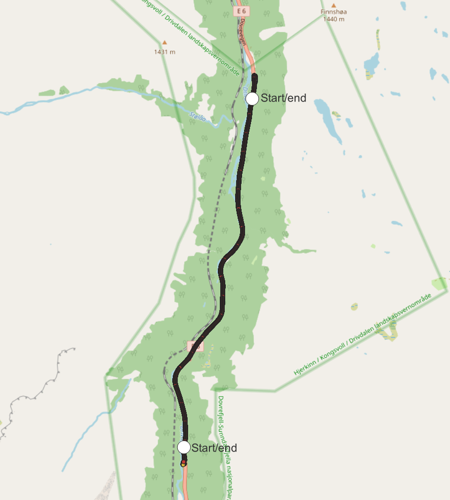

#### Table of Contents
* [Drivdalen](#header)
  * [The collected datasets](#datasets)
    * [October 20th 2021 (without snow)](#2021)
    * [January 26th 2022 (with snow)](#2022)
  * [Point clouds](#pointclouds)
* [The analysis](#analysis)
  * [Details](#details)
  * [Absolute navigation](#analysis-abs)
  * [Incremental navigation](#analysis-inc)
* [Run configs](#run-configs)
  * [Absolute, PCAPs from 2021, point cloud from 2021](#abs-pcap2021-pc2021)
  * [Absolute, PCAPs from 2021, point cloud from 2022](#abs-pcap2021-pc2022)
  * [Absolute, PCAPs from 2022, point cloud from 2021](#abs-pcap2022-pc2021)
  * [Absolute, PCAPs from 2022, point cloud from 2022](#abs-pcap2022-pc2022)
  * [Incremental, PCAPs from 2021](#inc-pcap2021)
  * [Incremental, PCAPs from 2022](#inc-pcap2022)

<a name="header"></a>
# Drivdalen

<a name="datasets"></a>
## The collected datasets

<a name="2021"></a>
### October 20th 2021 (without snow):
| Trip# | Direction   | Frequency | Start time | Comment |
|-------|-------------|-----------|------------|---------|
| 1     | North-South | 10 hz     | 13:39      | OK      |
| 2     | South-North | 10 hz     | 13:55      | OK      |
| 3     | North-South | 10 hz     | 14:03      | OK      |
| 4     | South-North | 10 hz     | 14:12      | OK      |
| 5     | North-South | 20 hz     | 14:23      | OK, folder marked as 10 hz, but it is 20 hz. |
| 6     | South-North | 20 hz     | 14:32      | OK, folder marked as 10 hz, but it is 20 hz. |
| 7     | North-South | 20 hz     | 14:41      | OK      |
| 8     | South-North | 20 hz     | 15:05      | OK      |
| 9     | North-South | 20 hz     | 16:16      | No SBET data. Confirmed by NMA.      |
| 10    | South-North | 20 hz     | 16:25      | No SBET data. Confirmed by NMA.      |


<a name="2022"></a>
### January 26th 2022 (with snow):
| Trip# | Direction   | Frequency | Start time | Comment |
|-------|-------------|-----------|------------|---------|
| 1     | North-South | 20 hz     | 15:14      | OK      |
| 2     | South-North | 20 hz     | 15:22      | OK      |
| 3     | North-South | 20 hz     | 15:30      | OK      |
| 4     | South-North | 20 hz     | 15:38      | OK      |
| 5     | South-North | 20 hz     | 15:45      | OK      |
| 6     | North-South | 20 hz     | 15:53      | OK      |
| 7     | South-North | 10 hz     | 16:02      | OK      |
| 8     | North-South | 10 hz     | 16:10      | OK      |
| 9     | South-North | 10 hz     | 16:17      | OK      |
| 10    | North-South | 10 hz     | 16:25      | OK      |

The trips are recorded in both directions; the two white circles show the analysis start or end points depending on which direction the trip is. 



<a name="pointclouds"></a>
# Point clouds
The point clouds are generated from trip 1 in 2021 and trip 1 in 2022 by the NMA. The resulting .laz files are merged into one using the following commands:
```
python pointCloud.py --create-from "validation\Drivdalen\2021-10-20\pointcloud" --write-to "validation\Drivdalen\2021-10-20\pointcloud\combined_100.pcd" --voxel-size 0.1
python pointCloud.py --create-from "validation\Drivdalen\2022-01-26\pointcloud" --write-to "validation\Drivdalen\2022-01-26\pointcloud\combined_100.pcd" --voxel-size 0.1
```

<a name="analysis"></a>
# The analysis

<a name="details"></a>
## Details

This section is about Drivdalen specifically. See [this document](./../../_notes/summary.md) for more method details that are common for all four locations.

To make the results comparable, the trip analyses all started at the same point. This point is indicated with the white circle on the image above. The analyses ran until failure, or until the actual position reached the end circle.

**Common command line arguments:**

Differs by trip direction. Command line arguments are identical except for switched skip-until and run-until arguments.

North-South:
```
{
	"preview": "always",
	"build-cloud-after": 5,
	"skip-until-x": 533125.505,
	"skip-until-y": 6916529.301,
	"run-until-x": 532188.611,
	"run-until-y": 6911485.961,
	"recreate-caches": true,
	"max-frame-radius": 25,
	"wait-after-first-frame": 15,
	"hide-point-cloud": true,
	"save-after-first-frame": true,
	"save-after-frames": 50,
	"raise-on-2d-error": 25,
	"raise-on-3d-error": 50,
    "sbet-crs-from": 4937,
    "sbet-crs-to": 5972,
    "use-actual-coordinate": false,
    "voxel-size": 0.1
}
```

South-North:
```
{
	"preview": "always",
	"build-cloud-after": 5,
	"skip-until-x": 532188.611,
	"skip-until-y": 6911485.961,
	"run-until-x": 533125.505,
	"run-until-y": 6916529.301,
	"recreate-caches": true,
	"max-frame-radius": 25,
	"wait-after-first-frame": 15,
	"hide-point-cloud": true,
	"save-after-first-frame": true,
	"save-after-frames": 50,
	"raise-on-2d-error": 25,
	"raise-on-3d-error": 50,
    "sbet-crs-from": 4937,
    "sbet-crs-to": 5972,
    "use-actual-coordinate": false,
    "voxel-size": 0.1
}
```

<a name="analysis-abs"></a>
## Absolute navigation

_**Meters driven before failure**_
| Trip#   | Bare/Bare | Bare/Snow | Snow/Bare | Snow/Snow |
|---------|-----------|-----------|-----------|-----------|
| 1     | 53.295 | 990.670 | 3.472 | 39.719 |
| 2     | 1,178.001 | 2,042.772 | 199.835 | N/P |
| 3     | 48.741 | 89.519 | 3.533 | 21.930 |
| 4     | 238.449 | 299.690 | 77.714 | 2,883.891 |
| 5     | N/P | N/P | 2.848 | 34.195 |
| 6     | N/P | N/P | 76.207 | 2,884.460 |
| 7     | 7.289 | 979.859 | 5.691 | 96.729 |
| 8     | 440.140 | 2,433.738 | 83.200 | 2,498.499 |
| 9     | N/P | N/P | 6.154 | N/P |
| 10     | N/P | N/P | 235.021 | N/P |
| **Average** | **327.652** | **1,139.375** | **69.368** | **1,208.489** |


_**Percentage of route driven before failure**_
| Trip#   | Bare/Bare | Bare/Snow | Snow/Bare | Snow/Snow |
|---------|-----------|-----------|-----------|-----------|
| 1     | 1.0 | 18.2 | 0.1 | 0.7 |
| 2     | 21.6 | 37.5 | 3.7 | N/P |
| 3     | 0.9 | 1.6 | 0.1 | 0.4 |
| 4     | 4.4 | 5.5 | 1.4 | 52.9 |
| 5     | N/P | N/P | 0.1 | 0.6 |
| 6     | N/P | N/P | 1.4 | 52.9 |
| 7     | 0.1 | 18.0 | 0.1 | 1.8 |
| 8     | 8.1 | 44.7 | 1.5 | 45.8 |
| 9     | N/P | N/P | 0.1 | N/P |
| 10     | N/P | N/P | 4.3 | N/P |
| **Average** | **6.0** | **20.9** | **1.3** | **22.2** |


_**2D difference between actual and estimated coordinates [M]**_
| Trip#   | Bare/Bare | Bare/Snow | Snow/Bare | Snow/Snow |
|---------|-----------|-----------|-----------|-----------|
| 1     | 5.254 | 2.148 | 8.796 | 13.107 |
| 2     | 0.444 | 1.210 | 1.867 | N/P |
| 3     | 4.054 | 8.926 | 8.541 | 12.552 |
| 4     | 1.141 | 1.930 | 1.475 | 0.906 |
| 5     | N/P | N/P | 9.372 | 12.105 |
| 6     | N/P | N/P | 1.455 | 0.910 |
| 7     | 9.740 | 1.413 | 8.023 | 12.156 |
| 8     | 0.478 | 1.416 | 3.243 | 1.196 |
| 9     | N/P | N/P | 8.672 | N/P |
| 10     | N/P | N/P | 2.701 | N/P |
| **Average** | **3.518** | **2.841** | **5.414** | **7.562** |


_**3D difference between actual and estimated coordinates [M]**_
| Trip#   | Bare/Bare | Bare/Snow | Snow/Bare | Snow/Snow |
|---------|-----------|-----------|-----------|-----------|
| 1     | 5.261 | 5.554 | 8.803 | 14.684 |
| 2     | 0.691 | 5.163 | 2.168 | N/P |
| 3     | 4.067 | 10.486 | 8.547 | 14.519 |
| 4     | 1.340 | 5.843 | 1.497 | 4.958 |
| 5     | N/P | N/P | 9.379 | 13.736 |
| 6     | N/P | N/P | 1.472 | 4.951 |
| 7     | 9.754 | 5.168 | 8.029 | 13.374 |
| 8     | 0.763 | 5.593 | 3.255 | 4.959 |
| 9     | N/P | N/P | 8.676 | N/P |
| 10     | N/P | N/P | 2.950 | N/P |
| **Average** | **3.646** | **6.301** | **5.478** | **10.169** |


_**Reported registration fitness**_
| Trip#   | Bare/Bare | Bare/Snow | Snow/Bare | Snow/Snow |
|---------|-----------|-----------|-----------|-----------|
| 1     | 0.931 | 0.998 | 0.943 | 0.996 |
| 2     | 0.858 | 0.995 | 0.837 | N/P |
| 3     | 0.936 | 0.976 | 0.939 | 0.995 |
| 4     | 0.843 | 0.988 | 0.769 | 0.999 |
| 5     | N/P | N/P | 0.937 | 0.997 |
| 6     | N/P | N/P | 0.771 | 1.000 |
| 7     | 0.922 | 0.998 | 0.930 | 0.967 |
| 8     | 0.859 | 0.993 | 0.734 | 0.998 |
| 9     | N/P | N/P | 0.934 | N/P |
| 10     | N/P | N/P | 0.816 | N/P |
| **Average** | **0.892** | **0.991** | **0.861** | **0.993** |


_**Reported registration RMSE**_
| Trip#   | Bare/Bare | Bare/Snow | Snow/Bare | Snow/Snow |
|---------|-----------|-----------|-----------|-----------|
| 1     | 0.172 | 0.149 | 0.264 | 0.167 |
| 2     | 0.197 | 0.193 | 0.279 | N/P |
| 3     | 0.158 | 0.180 | 0.261 | 0.176 |
| 4     | 0.219 | 0.184 | 0.308 | 0.062 |
| 5     | N/P | N/P | 0.260 | 0.145 |
| 6     | N/P | N/P | 0.301 | 0.060 |
| 7     | 0.169 | 0.145 | 0.262 | 0.207 |
| 8     | 0.199 | 0.179 | 0.322 | 0.081 |
| 9     | N/P | N/P | 0.263 | N/P |
| 10     | N/P | N/P | 0.280 | N/P |
| **Average** | **0.186** | **0.172** | **0.280** | **0.128** |


_**Registration iterations before convergence**_
| Trip#   | Bare/Bare | Bare/Snow | Snow/Bare | Snow/Snow |
|---------|-----------|-----------|-----------|-----------|
| 1     | 212.500 | 90.365 | 241.667 | 146.121 |
| 2     | 133.157 | 90.387 | 171.939 | N/P |
| 3     | 228.289 | 169.091 | 237.500 | 114.655 |
| 4     | 145.468 | 87.041 | 195.495 | 54.272 |
| 5     | N/P | N/P | 235.000 | 139.796 |
| 6     | N/P | N/P | 197.477 | 51.862 |
| 7     | 245.833 | 78.118 | 250.000 | 189.773 |
| 8     | 136.231 | 83.933 | 193.750 | 66.543 |
| 9     | N/P | N/P | 250.000 | N/P |
| 10     | N/P | N/P | 181.061 | N/P |
| **Average** | **183.580** | **99.822** | **215.389** | **109.003** |


_**LiDAR Frequency**_
| Trip#   | Bare/Bare | Bare/Snow | Snow/Bare | Snow/Snow |
|---------|-----------|-----------|-----------|-----------|
| 1     | 10 hz | 10 hz | 20 hz | 20 hz |
| 2     | 10 hz | 10 hz | 20 hz | 20 hz |
| 3     | 10 hz | 10 hz | 20 hz | 20 hz |
| 4     | 10 hz | 10 hz | 20 hz | 20 hz |
| 5     | 10 hz | 10 hz | 20 hz | 20 hz |
| 6     | 10 hz | 10 hz | 20 hz | 20 hz |
| 7     | 20 hz | 20 hz | 10 hz | 10 hz |
| 8     | 20 hz | 20 hz | 10 hz | 10 hz |
| 9     | 20 hz | 20 hz | 10 hz | 10 hz |
| 10     | 20 hz | 20 hz | 10 hz | 10 hz |


_**Links to individual trip details**_
| Trip#   | Bare/Bare | Bare/Snow | Snow/Bare | Snow/Snow |
|---------|-----------|-----------|-----------|-----------|
| 1     | [Link](./ABS%2C%20PCAP2021%2C%20PC2021/1_ned_10hz) | [Link](./ABS%2C%20PCAP2021%2C%20PC2022/1_ned_10hz) | [Link](./ABS%2C%20PCAP2022%2C%20PC2021/2_nordover_20hz) | [Link](./ABS%2C%20PCAP2022%2C%20PC2022/2_nordover_20hz) |
| 2     | [Link](./ABS%2C%20PCAP2021%2C%20PC2021/1_opp_10hz) | [Link](./ABS%2C%20PCAP2021%2C%20PC2022/1_opp_10hz) | [Link](./ABS%2C%20PCAP2022%2C%20PC2021/1_sorover_20hz) | N/P |
| 3     | [Link](./ABS%2C%20PCAP2021%2C%20PC2021/2_ned_10hz) | [Link](./ABS%2C%20PCAP2021%2C%20PC2022/2_ned_10hz) | [Link](./ABS%2C%20PCAP2022%2C%20PC2021/4_nordover_20hz) | [Link](./ABS%2C%20PCAP2022%2C%20PC2022/4_nordover_20hz) |
| 4     | [Link](./ABS%2C%20PCAP2021%2C%20PC2021/2_opp_10hz) | [Link](./ABS%2C%20PCAP2021%2C%20PC2022/2_opp_10hz) | [Link](./ABS%2C%20PCAP2022%2C%20PC2021/3_sorover_20hz) | [Link](./ABS%2C%20PCAP2022%2C%20PC2022/3_sorover_20hz) |
| 5     | N/P | N/P | [Link](./ABS%2C%20PCAP2022%2C%20PC2021/6_nordover_20hz) | [Link](./ABS%2C%20PCAP2022%2C%20PC2022/6_nordover_20hz) |
| 6     | N/P | N/P | [Link](./ABS%2C%20PCAP2022%2C%20PC2021/5_sorover_20hz) | [Link](./ABS%2C%20PCAP2022%2C%20PC2022/5_sorover_20hz) |
| 7     | [Link](./ABS%2C%20PCAP2021%2C%20PC2021/4_ned_20hz) | [Link](./ABS%2C%20PCAP2021%2C%20PC2022/4_ned_20hz) | [Link](./ABS%2C%20PCAP2022%2C%20PC2021/8_nordover_10hz) | [Link](./ABS%2C%20PCAP2022%2C%20PC2022/8_nordover_10hz) |
| 8     | [Link](./ABS%2C%20PCAP2021%2C%20PC2021/4_opp_20hz) | [Link](./ABS%2C%20PCAP2021%2C%20PC2022/4_opp_20hz) | [Link](./ABS%2C%20PCAP2022%2C%20PC2021/7_sorover_10hz) | [Link](./ABS%2C%20PCAP2022%2C%20PC2022/7_sorover_10hz) |
| 9     | N/P | N/P | [Link](./ABS%2C%20PCAP2022%2C%20PC2021/10_nordover_10hz) | N/P |
| 10     | N/P | N/P | [Link](./ABS%2C%20PCAP2022%2C%20PC2021/9_sorover_10hz) | N/P |

<a name="abs-pcap2021-pc2021"></a>
### Absolute, PCAPs from 2021, point cloud from 2021

```
python absoluteNavigator.py --pcap "validation\Drivdalen\2021-10-20\pcap\1_ned_10hz" --sbet "validation\Drivdalen\2021-10-20\navigation\sbet-output-UTC-1000.out" --point-cloud "validation\Drivdalen\2021-10-20\pointcloud\combined_100.pcd" --save-to "validation\Drivdalen\results\ABS, PCAP2021, PC2021\1_ned_10hz" --load-arguments "validation\Drivdalen\default-arguments.json"
python absoluteNavigator.py --pcap "validation\Drivdalen\2021-10-20\pcap\1_opp_10hz" --sbet "validation\Drivdalen\2021-10-20\navigation\sbet-output-UTC-1000.out" --point-cloud "validation\Drivdalen\2021-10-20\pointcloud\combined_100.pcd" --save-to "validation\Drivdalen\results\ABS, PCAP2021, PC2021\1_opp_10hz" --load-arguments "validation\Drivdalen\default-arguments-reversed.json"
python absoluteNavigator.py --pcap "validation\Drivdalen\2021-10-20\pcap\2_ned_10hz" --sbet "validation\Drivdalen\2021-10-20\navigation\sbet-output-UTC-1000.out" --point-cloud "validation\Drivdalen\2021-10-20\pointcloud\combined_100.pcd" --save-to "validation\Drivdalen\results\ABS, PCAP2021, PC2021\2_ned_10hz" --load-arguments "validation\Drivdalen\default-arguments.json"
python absoluteNavigator.py --pcap "validation\Drivdalen\2021-10-20\pcap\2_opp_10hz" --sbet "validation\Drivdalen\2021-10-20\navigation\sbet-output-UTC-1000.out" --point-cloud "validation\Drivdalen\2021-10-20\pointcloud\combined_100.pcd" --save-to "validation\Drivdalen\results\ABS, PCAP2021, PC2021\2_opp_10hz" --load-arguments "validation\Drivdalen\default-arguments-reversed.json"
python absoluteNavigator.py --pcap "validation\Drivdalen\2021-10-20\pcap\3_ned_20hz" --sbet "validation\Drivdalen\2021-10-20\navigation\sbet-output-UTC-1000.out" --point-cloud "validation\Drivdalen\2021-10-20\pointcloud\combined_100.pcd" --save-to "validation\Drivdalen\results\ABS, PCAP2021, PC2021\3_ned_20hz" --load-arguments "validation\Drivdalen\default-arguments.json"
python absoluteNavigator.py --pcap "validation\Drivdalen\2021-10-20\pcap\3_opp_20hz" --sbet "validation\Drivdalen\2021-10-20\navigation\sbet-output-UTC-1000.out" --point-cloud "validation\Drivdalen\2021-10-20\pointcloud\combined_100.pcd" --save-to "validation\Drivdalen\results\ABS, PCAP2021, PC2021\3_opp_20hz" --load-arguments "validation\Drivdalen\default-arguments-reversed.json"
python absoluteNavigator.py --pcap "validation\Drivdalen\2021-10-20\pcap\4_ned_20hz" --sbet "validation\Drivdalen\2021-10-20\navigation\sbet-output-UTC-1000.out" --point-cloud "validation\Drivdalen\2021-10-20\pointcloud\combined_100.pcd" --save-to "validation\Drivdalen\results\ABS, PCAP2021, PC2021\4_ned_20hz" --load-arguments "validation\Drivdalen\default-arguments.json"
python absoluteNavigator.py --pcap "validation\Drivdalen\2021-10-20\pcap\4_opp_20hz" --sbet "validation\Drivdalen\2021-10-20\navigation\sbet-output-UTC-1000.out" --point-cloud "validation\Drivdalen\2021-10-20\pointcloud\combined_100.pcd" --save-to "validation\Drivdalen\results\ABS, PCAP2021, PC2021\4_opp_20hz" --load-arguments "validation\Drivdalen\default-arguments-reversed.json"
python absoluteNavigator.py --pcap "validation\Drivdalen\2021-10-20\pcap\5_ned_20hz" --sbet "validation\Drivdalen\2021-10-20\navigation\sbet-output-UTC-1000.out" --point-cloud "validation\Drivdalen\2021-10-20\pointcloud\combined_100.pcd" --save-to "validation\Drivdalen\results\ABS, PCAP2021, PC2021\5_ned_20hz" --load-arguments "validation\Drivdalen\default-arguments.json"
python absoluteNavigator.py --pcap "validation\Drivdalen\2021-10-20\pcap\5_opp_20hz" --sbet "validation\Drivdalen\2021-10-20\navigation\sbet-output-UTC-1000.out" --point-cloud "validation\Drivdalen\2021-10-20\pointcloud\combined_100.pcd" --save-to "validation\Drivdalen\results\ABS, PCAP2021, PC2021\5_opp_20hz" --load-arguments "validation\Drivdalen\default-arguments-reversed.json"
```

<a name="abs-pcap2021-pc2022"></a>
### Absolute, PCAPs from 2021, point cloud from 2022

```
python absoluteNavigator.py --pcap "validation\Drivdalen\2021-10-20\pcap\1_ned_10hz" --sbet "validation\Drivdalen\2021-10-20\navigation\sbet-output-UTC-1000.out" --point-cloud "validation\Drivdalen\2022-01-26\pointcloud\combined_100.pcd" --save-to "validation\Drivdalen\results\ABS, PCAP2021, PC2022\1_ned_10hz" --load-arguments "validation\Drivdalen\default-arguments.json" --preview never
python absoluteNavigator.py --pcap "validation\Drivdalen\2021-10-20\pcap\1_opp_10hz" --sbet "validation\Drivdalen\2021-10-20\navigation\sbet-output-UTC-1000.out" --point-cloud "validation\Drivdalen\2022-01-26\pointcloud\combined_100.pcd" --save-to "validation\Drivdalen\results\ABS, PCAP2021, PC2022\1_opp_10hz" --load-arguments "validation\Drivdalen\default-arguments-reversed.json" --preview never
python absoluteNavigator.py --pcap "validation\Drivdalen\2021-10-20\pcap\2_ned_10hz" --sbet "validation\Drivdalen\2021-10-20\navigation\sbet-output-UTC-1000.out" --point-cloud "validation\Drivdalen\2022-01-26\pointcloud\combined_100.pcd" --save-to "validation\Drivdalen\results\ABS, PCAP2021, PC2022\2_ned_10hz" --load-arguments "validation\Drivdalen\default-arguments.json" --preview never
python absoluteNavigator.py --pcap "validation\Drivdalen\2021-10-20\pcap\2_opp_10hz" --sbet "validation\Drivdalen\2021-10-20\navigation\sbet-output-UTC-1000.out" --point-cloud "validation\Drivdalen\2022-01-26\pointcloud\combined_100.pcd" --save-to "validation\Drivdalen\results\ABS, PCAP2021, PC2022\2_opp_10hz" --load-arguments "validation\Drivdalen\default-arguments-reversed.json" --preview never
python absoluteNavigator.py --pcap "validation\Drivdalen\2021-10-20\pcap\3_ned_20hz" --sbet "validation\Drivdalen\2021-10-20\navigation\sbet-output-UTC-1000.out" --point-cloud "validation\Drivdalen\2022-01-26\pointcloud\combined_100.pcd" --save-to "validation\Drivdalen\results\ABS, PCAP2021, PC2022\3_ned_20hz" --load-arguments "validation\Drivdalen\default-arguments.json" --preview never
python absoluteNavigator.py --pcap "validation\Drivdalen\2021-10-20\pcap\3_opp_20hz" --sbet "validation\Drivdalen\2021-10-20\navigation\sbet-output-UTC-1000.out" --point-cloud "validation\Drivdalen\2022-01-26\pointcloud\combined_100.pcd" --save-to "validation\Drivdalen\results\ABS, PCAP2021, PC2022\3_opp_20hz" --load-arguments "validation\Drivdalen\default-arguments-reversed.json" --preview never
python absoluteNavigator.py --pcap "validation\Drivdalen\2021-10-20\pcap\4_ned_20hz" --sbet "validation\Drivdalen\2021-10-20\navigation\sbet-output-UTC-1000.out" --point-cloud "validation\Drivdalen\2022-01-26\pointcloud\combined_100.pcd" --save-to "validation\Drivdalen\results\ABS, PCAP2021, PC2022\4_ned_20hz" --load-arguments "validation\Drivdalen\default-arguments.json" --preview never
python absoluteNavigator.py --pcap "validation\Drivdalen\2021-10-20\pcap\4_opp_20hz" --sbet "validation\Drivdalen\2021-10-20\navigation\sbet-output-UTC-1000.out" --point-cloud "validation\Drivdalen\2022-01-26\pointcloud\combined_100.pcd" --save-to "validation\Drivdalen\results\ABS, PCAP2021, PC2022\4_opp_20hz" --load-arguments "validation\Drivdalen\default-arguments-reversed.json" --preview never
python absoluteNavigator.py --pcap "validation\Drivdalen\2021-10-20\pcap\5_ned_20hz" --sbet "validation\Drivdalen\2021-10-20\navigation\sbet-output-UTC-1000.out" --point-cloud "validation\Drivdalen\2022-01-26\pointcloud\combined_100.pcd" --save-to "validation\Drivdalen\results\ABS, PCAP2021, PC2022\5_ned_20hz" --load-arguments "validation\Drivdalen\default-arguments.json" --preview never
python absoluteNavigator.py --pcap "validation\Drivdalen\2021-10-20\pcap\5_opp_20hz" --sbet "validation\Drivdalen\2021-10-20\navigation\sbet-output-UTC-1000.out" --point-cloud "validation\Drivdalen\2022-01-26\pointcloud\combined_100.pcd" --save-to "validation\Drivdalen\results\ABS, PCAP2021, PC2022\5_opp_20hz" --load-arguments "validation\Drivdalen\default-arguments-reversed.json" --preview never
```

<a name="abs-pcap2022-pc2021"></a>
### Absolute, PCAPs from 2022, point cloud from 2021

```
python absoluteNavigator.py --pcap "validation\Drivdalen\2022-01-26\pcap\1_sorover_20hz" --sbet "validation\Drivdalen\2022-01-26\navigation\sbet-output-UTC-1000.out" --point-cloud "validation\Drivdalen\2021-10-20\pointcloud\combined_100.pcd" --save-to "validation\Drivdalen\results\ABS, PCAP2022, PC2021\1_sorover_20hz" --load-arguments "validation\Drivdalen\default-arguments-reversed.json" --preview never
python absoluteNavigator.py --pcap "validation\Drivdalen\2022-01-26\pcap\2_nordover_20hz" --sbet "validation\Drivdalen\2022-01-26\navigation\sbet-output-UTC-1000.out" --point-cloud "validation\Drivdalen\2021-10-20\pointcloud\combined_100.pcd" --save-to "validation\Drivdalen\results\ABS, PCAP2022, PC2021\2_nordover_20hz" --load-arguments "validation\Drivdalen\default-arguments.json" --preview never
python absoluteNavigator.py --pcap "validation\Drivdalen\2022-01-26\pcap\3_sorover_20hz" --sbet "validation\Drivdalen\2022-01-26\navigation\sbet-output-UTC-1000.out" --point-cloud "validation\Drivdalen\2021-10-20\pointcloud\combined_100.pcd" --save-to "validation\Drivdalen\results\ABS, PCAP2022, PC2021\3_sorover_20hz" --load-arguments "validation\Drivdalen\default-arguments-reversed.json" --preview never
python absoluteNavigator.py --pcap "validation\Drivdalen\2022-01-26\pcap\4_nordover_20hz" --sbet "validation\Drivdalen\2022-01-26\navigation\sbet-output-UTC-1000.out" --point-cloud "validation\Drivdalen\2021-10-20\pointcloud\combined_100.pcd" --save-to "validation\Drivdalen\results\ABS, PCAP2022, PC2021\4_nordover_20hz" --load-arguments "validation\Drivdalen\default-arguments.json" --preview never
python absoluteNavigator.py --pcap "validation\Drivdalen\2022-01-26\pcap\5_sorover_20hz" --sbet "validation\Drivdalen\2022-01-26\navigation\sbet-output-UTC-1000.out" --point-cloud "validation\Drivdalen\2021-10-20\pointcloud\combined_100.pcd" --save-to "validation\Drivdalen\results\ABS, PCAP2022, PC2021\5_sorover_20hz" --load-arguments "validation\Drivdalen\default-arguments-reversed.json" --preview never
python absoluteNavigator.py --pcap "validation\Drivdalen\2022-01-26\pcap\6_nordover_20hz" --sbet "validation\Drivdalen\2022-01-26\navigation\sbet-output-UTC-1000.out" --point-cloud "validation\Drivdalen\2021-10-20\pointcloud\combined_100.pcd" --save-to "validation\Drivdalen\results\ABS, PCAP2022, PC2021\6_nordover_20hz" --load-arguments "validation\Drivdalen\default-arguments.json" --preview never
python absoluteNavigator.py --pcap "validation\Drivdalen\2022-01-26\pcap\7_sorover_10hz" --sbet "validation\Drivdalen\2022-01-26\navigation\sbet-output-UTC-1000.out" --point-cloud "validation\Drivdalen\2021-10-20\pointcloud\combined_100.pcd" --save-to "validation\Drivdalen\results\ABS, PCAP2022, PC2021\7_sorover_10hz" --load-arguments "validation\Drivdalen\default-arguments-reversed.json" --preview never
python absoluteNavigator.py --pcap "validation\Drivdalen\2022-01-26\pcap\8_nordover_10hz" --sbet "validation\Drivdalen\2022-01-26\navigation\sbet-output-UTC-1000.out" --point-cloud "validation\Drivdalen\2021-10-20\pointcloud\combined_100.pcd" --save-to "validation\Drivdalen\results\ABS, PCAP2022, PC2021\8_nordover_10hz" --load-arguments "validation\Drivdalen\default-arguments.json" --preview never
python absoluteNavigator.py --pcap "validation\Drivdalen\2022-01-26\pcap\9_sorover_10hz" --sbet "validation\Drivdalen\2022-01-26\navigation\sbet-output-UTC-1000.out" --point-cloud "validation\Drivdalen\2021-10-20\pointcloud\combined_100.pcd" --save-to "validation\Drivdalen\results\ABS, PCAP2022, PC2021\9_sorover_10hz" --load-arguments "validation\Drivdalen\default-arguments-reversed.json" --preview never
python absoluteNavigator.py --pcap "validation\Drivdalen\2022-01-26\pcap\10_nordover_10hz" --sbet "validation\Drivdalen\2022-01-26\navigation\sbet-output-UTC-1000.out" --point-cloud "validation\Drivdalen\2021-10-20\pointcloud\combined_100.pcd" --save-to "validation\Drivdalen\results\ABS, PCAP2022, PC2021\10_nordover_10hz" --load-arguments "validation\Drivdalen\default-arguments.json" --preview never
```

<a name="abs-pcap2022-pc2022"></a>
### Absolute, PCAPs from 2022, point cloud from 2022

```
python absoluteNavigator.py --pcap "validation\Drivdalen\2022-01-26\pcap\1_sorover_20hz" --sbet "validation\Drivdalen\2022-01-26\navigation\sbet-output-UTC-1000.out" --point-cloud "validation\Drivdalen\2022-01-26\pointcloud\combined_100.pcd" --save-to "validation\Drivdalen\results\ABS, PCAP2022, PC2022\1_sorover_20hz" --load-arguments "validation\Drivdalen\default-arguments-reversed.json" --preview never
python absoluteNavigator.py --pcap "validation\Drivdalen\2022-01-26\pcap\2_nordover_20hz" --sbet "validation\Drivdalen\2022-01-26\navigation\sbet-output-UTC-1000.out" --point-cloud "validation\Drivdalen\2022-01-26\pointcloud\combined_100.pcd" --save-to "validation\Drivdalen\results\ABS, PCAP2022, PC2022\2_nordover_20hz" --load-arguments "validation\Drivdalen\default-arguments.json" --preview never
python absoluteNavigator.py --pcap "validation\Drivdalen\2022-01-26\pcap\3_sorover_20hz" --sbet "validation\Drivdalen\2022-01-26\navigation\sbet-output-UTC-1000.out" --point-cloud "validation\Drivdalen\2022-01-26\pointcloud\combined_100.pcd" --save-to "validation\Drivdalen\results\ABS, PCAP2022, PC2022\3_sorover_20hz" --load-arguments "validation\Drivdalen\default-arguments-reversed.json" --preview never
python absoluteNavigator.py --pcap "validation\Drivdalen\2022-01-26\pcap\4_nordover_20hz" --sbet "validation\Drivdalen\2022-01-26\navigation\sbet-output-UTC-1000.out" --point-cloud "validation\Drivdalen\2022-01-26\pointcloud\combined_100.pcd" --save-to "validation\Drivdalen\results\ABS, PCAP2022, PC2022\4_nordover_20hz" --load-arguments "validation\Drivdalen\default-arguments.json" --preview never
python absoluteNavigator.py --pcap "validation\Drivdalen\2022-01-26\pcap\5_sorover_20hz" --sbet "validation\Drivdalen\2022-01-26\navigation\sbet-output-UTC-1000.out" --point-cloud "validation\Drivdalen\2022-01-26\pointcloud\combined_100.pcd" --save-to "validation\Drivdalen\results\ABS, PCAP2022, PC2022\5_sorover_20hz" --load-arguments "validation\Drivdalen\default-arguments-reversed.json" --preview never
python absoluteNavigator.py --pcap "validation\Drivdalen\2022-01-26\pcap\6_nordover_20hz" --sbet "validation\Drivdalen\2022-01-26\navigation\sbet-output-UTC-1000.out" --point-cloud "validation\Drivdalen\2022-01-26\pointcloud\combined_100.pcd" --save-to "validation\Drivdalen\results\ABS, PCAP2022, PC2022\6_nordover_20hz" --load-arguments "validation\Drivdalen\default-arguments.json" --preview never
python absoluteNavigator.py --pcap "validation\Drivdalen\2022-01-26\pcap\7_sorover_10hz" --sbet "validation\Drivdalen\2022-01-26\navigation\sbet-output-UTC-1000.out" --point-cloud "validation\Drivdalen\2022-01-26\pointcloud\combined_100.pcd" --save-to "validation\Drivdalen\results\ABS, PCAP2022, PC2022\7_sorover_10hz" --load-arguments "validation\Drivdalen\default-arguments-reversed.json" --preview never
python absoluteNavigator.py --pcap "validation\Drivdalen\2022-01-26\pcap\8_nordover_10hz" --sbet "validation\Drivdalen\2022-01-26\navigation\sbet-output-UTC-1000.out" --point-cloud "validation\Drivdalen\2022-01-26\pointcloud\combined_100.pcd" --save-to "validation\Drivdalen\results\ABS, PCAP2022, PC2022\8_nordover_10hz" --load-arguments "validation\Drivdalen\default-arguments.json" --preview never
python absoluteNavigator.py --pcap "validation\Drivdalen\2022-01-26\pcap\9_sorover_21Hz" --sbet "validation\Drivdalen\2022-01-26\navigation\sbet-output-UTC-1000.out" --point-cloud "validation\Drivdalen\2022-01-26\pointcloud\combined_100.pcd" --save-to "validation\Drivdalen\results\ABS, PCAP2022, PC2022\9_sorover_10hz" --load-arguments "validation\Drivdalen\default-arguments-reversed.json" --preview never
python absoluteNavigator.py --pcap "validation\Drivdalen\2022-01-26\pcap\10_nordover_21Hz" --sbet "validation\Drivdalen\2022-01-26\navigation\sbet-output-UTC-1000.out" --point-cloud "validation\Drivdalen\2022-01-26\pointcloud\combined_100.pcd" --save-to "validation\Drivdalen\results\ABS, PCAP2022, PC2022\10_nordover_10hz" --load-arguments "validation\Drivdalen\default-arguments.json" --preview never
```