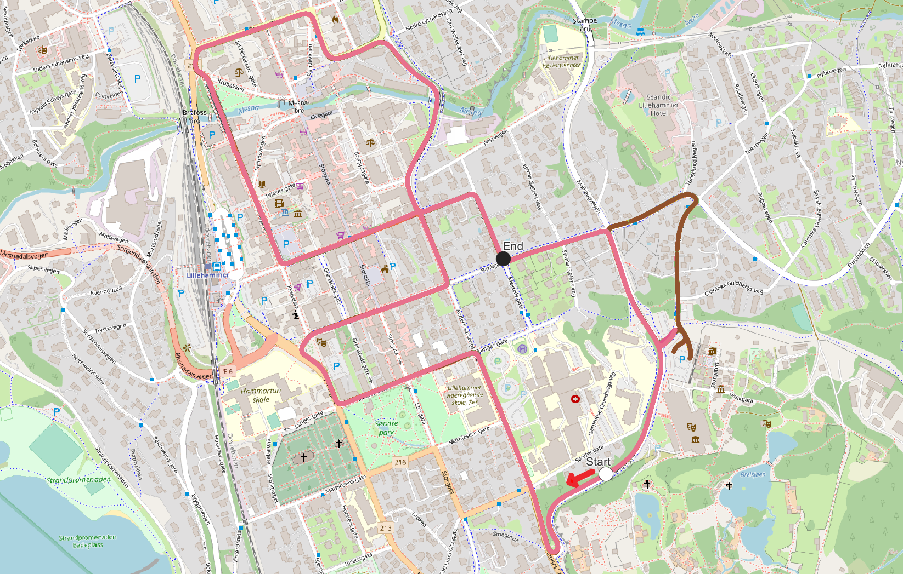

#### Table of Contents
* [Lillehammer](#header)
  * [The collected datasets](#datasets)
    * [October 21th 2021 (without snow)](#2021)
    * [February 16th 2022 (with snow)](#2022)
  * [Point clouds](#pointclouds)
* [The analysis](#analysis)
  * [Details](#details)
  * [Absolute navigation](#analysis-abs)
  * [Incremental navigation](#analysis-inc)
* [Run configs](#run-configs)
  * [Absolute, PCAPs from 2021, point cloud from 2021](#abs-pcap2021-pc2021)
  * [Absolute, PCAPs from 2021, point cloud from 2022](#abs-pcap2021-pc2022)
  * [Absolute, PCAPs from 2022, point cloud from 2021](#abs-pcap2022-pc2021)
  * [Absolute, PCAPs from 2022, point cloud from 2022](#abs-pcap2022-pc2022)
  * [Incremental, PCAPs from 2021](#inc-pcap2021)
  * [Incremental, PCAPs from 2022](#inc-pcap2022)

<a name="header"></a>
# Lillehammer

<a name="datasets"></a>
## The collected datasets

<a name="2021"></a>
### October 21th 2021 (without snow):
| Trip# | Frequency | Start time | Comment |
|-------|-----------|------------|---------|
| 1     | 10 hz     | 14:43      | No SBET data, unusable. Confirmed by KV. |
| 2 | 10 hz | 15:09 | No SBET data, unusable. Confirmed by KV. |
| 3 | 10 hz | 19:45 | OK |
| 4 | 10 hz | 20:01 | OK |
| 5 | 20 hz | 20:19 | OK |
| 6 | 20 hz | 20:35 | OK, slight detour at 255855.01,6784094.03 |
| 7 | 20 hz | 21:17 | OK |


<a name="2022"></a>
### February 16th 2022 (with snow):
| Trip# | Frequency | Start time | Comment |
|-------|-----------|------------|---------|
| 1 | 10 hz | 19:53 | OK |
| 2 | 10 hz | 20:04 | OK, navigation issues after 579295.42,6776465.81 |
| 3 | 20 hz | 20:27 | OK, missing one PCAP file in the beginning, but we skip that part of the route in the analysis. |
| 4 | 20 hz | 20:38 | OK |
| 5 | 20 hz | 20:48 | OK |

The image below shows the driving route on a map of Lillehammer. All 10 valid trips are drawn, but as they are very similar, it's hard to differentiate them in this plot. The brown detour on the right hand side is part of the 2021 trips -- they started at the parkin spot at the bottom end of the brown arm, and drove north before entering the standard route. The 2022 trips started approximately at the same spot, but drove west, directly entering the route. Because of this discrepancy, and because trip 2022-3 is missing a PCAP file, the analysis start point is set to be after all trips are driving the same route without issues (white circle), and because of the navigation issues in trip 2022-2, the end point is set to the last left turn (black circle).



<a name="pointclouds"></a>
# Point clouds
The point clouds are generated from trip 3 in 2021 and trip 1 in 2022 by the NMA. The resulting .laz files are merged into one using the following commands:
```
python pointCloud.py --create-from "validation\Lillehammer\2021-10-21\pointcloud\Referansepunktsky" --preview never --write-to "validation\Lillehammer\2021-10-21\pointcloud\combined.pcd" --voxel-size 0.2
python pointCloud.py --create-from "validation\Lillehammer\2022-02-16\pointcloud" --preview never --write-to "validation\Lillehammer\2022-02-16\pointcloud\combined.pcd" --voxel-size 0.2
```

<a name="analysis"></a>
# The analysis

<a name="details"></a>
## Details

This section is about Lillehammer specifically. See [this document](./../../_notes/summary.md) for more method details that are common for all four locations.

To make the results comparable, the trip analyses all started at the same point, which is set to after the missing PCAP file of trip 3 in 2022. This point is indicated with the white circle on the image above. The analyses ran until failure, or until the actual position reached the end circle (black).

**Common command line arguments:**
```
{
	"preview": "always",
	"build-cloud-after": 5,
	"skip-until-x": 579490.13,
	"skip-until-y": 6776060.22,
	"run-until-x": 579295.42,
	"run-until-y": 6776465.81,
	"recreate-caches": true,
	"max-frame-radius": 25,
	"wait-after-first-frame": 0,
	"hide-point-cloud": true,
	"save-after-first-frame": true,
	"save-after-frames": 50,
	"raise-on-2d-error": 25,
	"raise-on-3d-error": 50
}
```

<a name="analysis-abs"></a>
## Absolute navigation

The absolute navigation tables show how well the navigation worked in each of the four weather situations:
 - Bare/Bare means that the trips from 2021 (without snow) are run against the point cloud from 2021 (without snow).
 - Bare/Snow means that the trips from 2021 (without snow) are run against the point cloud from 2022 (with snow).
 - Snow/Bare means that the trips from 2022 (with snow) are run against the point cloud from 2021 (without snow).
 - Snow/Snow means that the trips from 2022 (with snow) are run against the point cloud from 2022 (with snow).

The numbers in the four results column represents the results for that combination, and are explained before each of the tables. Letters in those columns mean:
- N/A: This trip does not exist in this source material.
- N/P: This trip has not yet been processed.

_**Meters driven before failure**_

All entries with ~3200 meters did complete the entire route, but because of slight variances in driving routes, the lengths vary slightly.

| Trip#   | Bare/Bare | Bare/Snow | Snow/Bare | Snow/Snow |
|---------|-----------|-----------|-----------|-----------|
| 1     | N/A | N/A | 27.757 | 3,210.851 |
| 2     | N/A | N/A | 46.361 | 3,209.959 |
| 3     | 3,206.431 | 46.084 | 3,216.194 | 3,216.194 |
| 4     | 3,205.241 | 48.181 | 3,206.727 | 1,432.426 |
| 5     | 3,206.739 | 3,206.739 | 3,210.271 | 1,481.435 |
| 6     | 3,207.228 | 3,207.228 | N/A | N/A |
| 7     | N/P | N/P | N/A | N/A |
| **Average** | **3,206.410** | **1,627.058** | **1,941.462** | **2,510.173** |


_**Percentage of route driven before failure**_
| Trip#   | Bare/Bare | Bare/Snow | Snow/Bare | Snow/Snow |
|---------|-----------|-----------|-----------|-----------|
| 1     | N/A | N/A | 0.9 | 100.0 |
| 2     | N/A | N/A | 1.4 | 100.0 |
| 3     | 100.0 | 1.4 | 100.0 | 100.0 |
| 4     | 100.0 | 1.5 | 100.0 | 100.0 |
| 5     | 100.0 | 100.0 | 100.0 | 100.0 |
| 6     | 100.0 | 100.0 | N/A | N/A |
| 7     | N/P | N/P | N/A | N/A |
| **Average** | **100.0** | **50.7** | **60.5** | **100.0** |


_**2D difference between actual and estimated coordinates [M]**_
| Trip#   | Bare/Bare | Bare/Snow | Snow/Bare | Snow/Snow |
|---------|-----------|-----------|-----------|-----------|
| 1     | N/A | N/A | 1.088 | 0.774 |
| 2     | N/A | N/A | 1.196 | 0.816 |
| 3     | 0.573 | 0.972 | 0.844 | 0.868 |
| 4     | 0.582 | 1.606 | 0.832 | 0.944 |
| 5     | 0.540 | 1.019 | 0.868 | 0.933 |
| 6     | 0.527 | 0.978 | N/A | N/A |
| 7     | N/P | N/P | N/A | N/A |
| **Average** | **0.556** | **1.144** | **0.965** | **0.867** |


_**3D difference between actual and estimated coordinates [M]**_
| Trip#   | Bare/Bare | Bare/Snow | Snow/Bare | Snow/Snow |
|---------|-----------|-----------|-----------|-----------|
| 1     | N/A | N/A | 1.245 | 0.933 |
| 2     | N/A | N/A | 1.310 | 0.951 |
| 3     | 0.650 | 1.136 | 0.948 | 1.011 |
| 4     | 0.671 | 1.714 | 0.957 | 1.048 |
| 5     | 0.624 | 1.149 | 0.978 | 1.048 |
| 6     | 0.628 | 1.111 | N/A | N/A |
| 7     | N/P | N/P | N/A | N/A |
| **Average** | **0.643** | **1.278** | **1.088** | **0.998** |


_**Reported registration fitness**_
| Trip#   | Bare/Bare | Bare/Snow | Snow/Bare | Snow/Snow |
|---------|-----------|-----------|-----------|-----------|
| 1     | N/A | N/A | 0.966 | 0.998 |
| 2     | N/A | N/A | 0.964 | 1.000 |
| 3     | 0.984 | 0.904 | 0.981 | 0.999 |
| 4     | 0.889 | 0.976 | 0.979 | 0.998 |
| 5     | 0.984 | 0.995 | 0.982 | 1.000 |
| 6     | 0.899 | 0.994 | N/A | N/A |
| 7     | N/P | N/P | N/A | N/A |
| **Average** | **0.939** | **0.967** | **0.974** | **0.999** |


_**Reported registration RMSE**_
| Trip#   | Bare/Bare | Bare/Snow | Snow/Bare | Snow/Snow |
|---------|-----------|-----------|-----------|-----------|
| 1     | N/A | N/A | 0.200 | 0.065 |
| 2     | N/A | N/A | 0.188 | 0.051 |
| 3     | 0.073 | 0.186 | 0.124 | 0.050 |
| 4     | 0.103 | 0.202 | 0.129 | 0.057 |
| 5     | 0.077 | 0.122 | 0.123 | 0.046 |
| 6     | 0.092 | 0.125 | N/A | N/A |
| 7     | N/P | N/P | N/A | N/A |
| **Average** | **0.086** | **0.159** | **0.153** | **0.054** |


_**Registration iterations before convergence**_
| Trip#   | Bare/Bare | Bare/Snow | Snow/Bare | Snow/Snow |
|---------|-----------|-----------|-----------|-----------|
| 1     | N/A | N/A | 200.000 | 79.138 |
| 2     | N/A | N/A | 200.000 | 78.574 |
| 3     | 199.965 | 200.000 | 199.887 | 73.497 |
| 4     | 200.000 | 156.731 | 63.784 | 75.210 |
| 5     | 199.896 | 67.757 | 63.477 | 75.902 |
| 6     | 199.927 | 69.412 | N/A | N/A |
| 7     | N/P | N/P | N/A | N/A |
| **Average** | **199.947** | **123.475** | **145.429** | **76.464** |


_**LiDAR Frequency**_
| Trip#   | Bare/Bare | Bare/Snow | Snow/Bare | Snow/Snow |
|---------|-----------|-----------|-----------|-----------|
| 1     | - | - | 10 hz | 10 hz |
| 2     | - | - | 10 hz | 10 hz |
| 3     | 10 hz | 10 hz | 20 hz | 20 hz |
| 4     | 10 hz | 10 hz | 20 hz | 20 hz |
| 5     | 20 hz | 20 hz | 20 hz | 20 hz |
| 6     | 20 hz | 20 hz | - | - |
| 7     | 20 hz | 20 hz | - | - |


_**Links to individual trip details**_
| Trip#   | Bare/Bare | Bare/Snow | Snow/Bare | Snow/Snow |
|---------|-----------|-----------|-----------|-----------|
| 1     | N/A | N/A | [Link](./ABS%2C%20PCAP2022%2C%20PC2021/1_10hz) | [Link](./ABS%2C%20PCAP2022%2C%20PC2022/1_10hz) |
| 2     | N/A | N/A | [Link](./ABS%2C%20PCAP2022%2C%20PC2021/2_10hz) | [Link](./ABS%2C%20PCAP2022%2C%20PC2022/2_10hz) |
| 3     | [Link](./ABS%2C%20PCAP2021%2C%20PC2021/3_10hz) | [Link](./ABS%2C%20PCAP2021%2C%20PC2022/3_10hz) | [Link](./ABS%2C%20PCAP2022%2C%20PC2021/3_20hz) | [Link](./ABS%2C%20PCAP2022%2C%20PC2022/3_20hz) |
| 4     | [Link](./ABS%2C%20PCAP2021%2C%20PC2021/4_10hz) | [Link](./ABS%2C%20PCAP2021%2C%20PC2022/4_10hz) | [Link](./ABS%2C%20PCAP2022%2C%20PC2021/4_20hz) | [Link](./ABS%2C%20PCAP2022%2C%20PC2022/4_20hz) |
| 5     | [Link](./ABS%2C%20PCAP2021%2C%20PC2021/5_20hz) | [Link](./ABS%2C%20PCAP2021%2C%20PC2022/5_20hz) | [Link](./ABS%2C%20PCAP2022%2C%20PC2021/5_20hz) | [Link](./ABS%2C%20PCAP2022%2C%20PC2022/5_20hz) |
| 6     | [Link](./ABS%2C%20PCAP2021%2C%20PC2021/6_20hz) | [Link](./ABS%2C%20PCAP2021%2C%20PC2022/6_20hz) | N/A | N/A |
| 7     | N/P | N/P | N/A | N/A |

<a name="analysis-inc"></a>
## Incremental navigation

_**Meters driven before failure**_
| Trip#   | Bare      |      Snow |
|---------|-----------|-----------|
| 1     | N/A | N/A |
| 2     | 24.456 | 32.291 |
| 3     | 27.483 | 33.903 |
| 4     | 3.703 | 331.100 |
| 5     | 274.975 | 224.090 |
| **Average** | **82.654** | **155.346** |


_**Percentage of route driven before failure**_
| Trip#   | Bare      |      Snow |
|---------|-----------|-----------|
| 1     | N/A | N/A |
| 2     | 0.8 | 1.0 |
| 3     | 0.9 | 1.1 |
| 4     | 0.1 | 10.3 |
| 5     | 8.6 | 7.0 |
| **Average** | **2.6** | **4.9** |


_**2D difference between actual and estimated coordinates [M]**_
| Trip#   | Bare      |      Snow |
|---------|-----------|-----------|
| 1     | N/A | N/A |
| 2     | 1.005 | 1.207 |
| 3     | 0.957 | 0.636 |
| 4     | 0.437 | 3.230 |
| 5     | 2.634 | 2.981 |
| **Average** | **1.258** | **2.013** |


_**3D difference between actual and estimated coordinates [M]**_
| Trip#   | Bare      |      Snow |
|---------|-----------|-----------|
| 1     | N/A | N/A |
| 2     | 1.980 | 2.575 |
| 3     | 2.147 | 2.453 |
| 4     | 0.583 | 17.649 |
| 5     | 15.382 | 14.142 |
| **Average** | **5.023** | **9.205** |


_**Reported registration fitness**_
| Trip#   | Bare      |      Snow |
|---------|-----------|-----------|
| 1     | N/A | N/A |
| 2     | 0.996 | 0.994 |
| 3     | 0.997 | 0.999 |
| 4     | 0.999 | 0.999 |
| 5     | 0.999 | 0.999 |
| **Average** | **0.998** | **0.998** |


_**Reported registration RMSE**_
| Trip#   | Bare      |      Snow |
|---------|-----------|-----------|
| 1     | N/A | N/A |
| 2     | 0.160 | 0.164 |
| 3     | 0.156 | 0.129 |
| 4     | 0.123 | 0.094 |
| 5     | 0.110 | 0.097 |
| **Average** | **0.137** | **0.121** |


_**Registration iterations before convergence**_
| Trip#   | Bare      |      Snow |
|---------|-----------|-----------|
| 1     | N/A | N/A |
| 2     | 54.167 | 52.500 |
| 3     | 54.167 | 50.000 |
| 4     | 50.000 | 50.000 |
| 5     | 50.338 | 50.043 |
| **Average** | **52.168** | **50.636** |


_**LiDAR Frequency**_
| Trip#   | Bare      |      Snow |
|---------|-----------|-----------|
| 1     | - | - |
| 2     | 10 hz | 10 hz |
| 3     | 10 hz | 10 hz |
| 4     | 20 hz | 20 hz |
| 5     | 20 hz | 20 hz |


_**Links to individual trip details**_
| Trip#   | Bare      |      Snow |
|---------|-----------|-----------|
| 1     | N/A | N/A |
| 2     | [Link](./INC%2C%20PCAP2021%2C%20correct%20heading/3_10hz) | [Link](./INC%2C%20PCAP2022/1_10hz) |
| 3     | [Link](./INC%2C%20PCAP2021%2C%20correct%20heading/4_10hz) | [Link](./INC%2C%20PCAP2022/2_10hz) |
| 4     | [Link](./INC%2C%20PCAP2021%2C%20correct%20heading/5_20hz) | [Link](./INC%2C%20PCAP2022/3_20hz) |
| 5     | [Link](./INC%2C%20PCAP2021%2C%20correct%20heading/6_20hz) | [Link](./INC%2C%20PCAP2022/4_20hz) |

<a name="run-configs"></a>
## Run configurations

<a name="abs-pcap2021-pc2021"></a>
### Absolute, PCAPs from 2021, point cloud from 2021

```
python absoluteNavigator.py --pcap "validation\Lillehammer\2021-10-21\pcap\3_10hz" --sbet "validation\Lillehammer\2021-10-21\navigation\sbet-output-UTC-1000.out" --point-cloud "validation\Lillehammer\2021-10-21\pointcloud\combined.pcd" --save-to "validation\Lillehammer\results\ABS, PCAP2021, PC2021\3_10hz" --load-arguments "validation\Lillehammer\default-arguments.json"
python absoluteNavigator.py --pcap "validation\Lillehammer\2021-10-21\pcap\4_10hz" --sbet "validation\Lillehammer\2021-10-21\navigation\sbet-output-UTC-1000.out" --point-cloud "validation\Lillehammer\2021-10-21\pointcloud\combined.pcd" --save-to "validation\Lillehammer\results\ABS, PCAP2021, PC2021\4_10hz" --load-arguments "validation\Lillehammer\default-arguments.json"
python absoluteNavigator.py --pcap "validation\Lillehammer\2021-10-21\pcap\5_20hz" --sbet "validation\Lillehammer\2021-10-21\navigation\sbet-output-UTC-1000.out" --point-cloud "validation\Lillehammer\2021-10-21\pointcloud\combined.pcd" --save-to "validation\Lillehammer\results\ABS, PCAP2021, PC2021\5_20hz" --load-arguments "validation\Lillehammer\default-arguments.json"
python absoluteNavigator.py --pcap "validation\Lillehammer\2021-10-21\pcap\6_20hz" --sbet "validation\Lillehammer\2021-10-21\navigation\sbet-output-UTC-1000.out" --point-cloud "validation\Lillehammer\2021-10-21\pointcloud\combined.pcd" --save-to "validation\Lillehammer\results\ABS, PCAP2021, PC2021\6_20hz" --load-arguments "validation\Lillehammer\default-arguments.json"
python absoluteNavigator.py --pcap "validation\Lillehammer\2021-10-21\pcap\7_20hz" --sbet "validation\Lillehammer\2021-10-21\navigation\sbet-output-UTC-1000.out" --point-cloud "validation\Lillehammer\2021-10-21\pointcloud\combined.pcd" --save-to "validation\Lillehammer\results\ABS, PCAP2021, PC2021\7_20hz" --load-arguments "validation\Lillehammer\default-arguments.json"
```

<a name="abs-pcap2021-pc2022"></a>
### Absolute, PCAPs from 2021, point cloud from 2022

```
python absoluteNavigator.py --pcap "validation\Lillehammer\2021-10-21\pcap\3_10hz" --sbet "validation\Lillehammer\2021-10-21\navigation\sbet-output-UTC-1000.out" --point-cloud "validation\Lillehammer\2022-02-16\pointcloud\combined.pcd" --save-to "validation\Lillehammer\results\ABS, PCAP2021, PC2022\3_10hz" --load-arguments "validation\Lillehammer\default-arguments.json"
python absoluteNavigator.py --pcap "validation\Lillehammer\2021-10-21\pcap\4_10hz" --sbet "validation\Lillehammer\2021-10-21\navigation\sbet-output-UTC-1000.out" --point-cloud "validation\Lillehammer\2022-02-16\pointcloud\combined.pcd" --save-to "validation\Lillehammer\results\ABS, PCAP2021, PC2022\4_10hz" --load-arguments "validation\Lillehammer\default-arguments.json"
python absoluteNavigator.py --pcap "validation\Lillehammer\2021-10-21\pcap\5_20hz" --sbet "validation\Lillehammer\2021-10-21\navigation\sbet-output-UTC-1000.out" --point-cloud "validation\Lillehammer\2022-02-16\pointcloud\combined.pcd" --save-to "validation\Lillehammer\results\ABS, PCAP2021, PC2022\5_20hz" --load-arguments "validation\Lillehammer\default-arguments.json"
python absoluteNavigator.py --pcap "validation\Lillehammer\2021-10-21\pcap\6_20hz" --sbet "validation\Lillehammer\2021-10-21\navigation\sbet-output-UTC-1000.out" --point-cloud "validation\Lillehammer\2022-02-16\pointcloud\combined.pcd" --save-to "validation\Lillehammer\results\ABS, PCAP2021, PC2022\6_20hz" --load-arguments "validation\Lillehammer\default-arguments.json"
python absoluteNavigator.py --pcap "validation\Lillehammer\2021-10-21\pcap\7_20hz" --sbet "validation\Lillehammer\2021-10-21\navigation\sbet-output-UTC-1000.out" --point-cloud "validation\Lillehammer\2022-02-16\pointcloud\combined.pcd" --save-to "validation\Lillehammer\results\ABS, PCAP2021, PC2022\7_20hz" --load-arguments "validation\Lillehammer\default-arguments.json"
```

<a name="abs-pcap2022-pc2021"></a>
### Absolute, PCAPs from 2022, point cloud from 2021

```
python absoluteNavigator.py --pcap "validation\Lillehammer\2022-02-16\pcap\1_10hz" --sbet "validation\Lillehammer\2022-02-16\navigation\sbet_teapot.csv" --point-cloud "validation\Lillehammer\2021-10-21\pointcloud\combined.pcd" --save-to "validation\Lillehammer\results\ABS, PCAP2022, PC2021\1_10hz" --load-arguments "validation\Lillehammer\default-arguments.json"
python absoluteNavigator.py --pcap "validation\Lillehammer\2022-02-16\pcap\2_10hz" --sbet "validation\Lillehammer\2022-02-16\navigation\sbet_teapot.csv" --point-cloud "validation\Lillehammer\2021-10-21\pointcloud\combined.pcd" --save-to "validation\Lillehammer\results\ABS, PCAP2022, PC2021\2_10hz" --load-arguments "validation\Lillehammer\default-arguments.json"
python absoluteNavigator.py --pcap "validation\Lillehammer\2022-02-16\pcap\3_20hz" --sbet "validation\Lillehammer\2022-02-16\navigation\sbet_teapot.csv" --point-cloud "validation\Lillehammer\2021-10-21\pointcloud\combined.pcd" --save-to "validation\Lillehammer\results\ABS, PCAP2022, PC2021\3_20hz" --load-arguments "validation\Lillehammer\default-arguments.json"
python absoluteNavigator.py --pcap "validation\Lillehammer\2022-02-16\pcap\4_20hz" --sbet "validation\Lillehammer\2022-02-16\navigation\sbet_teapot.csv" --point-cloud "validation\Lillehammer\2021-10-21\pointcloud\combined.pcd" --save-to "validation\Lillehammer\results\ABS, PCAP2022, PC2021\4_20hz" --load-arguments "validation\Lillehammer\default-arguments.json"
python absoluteNavigator.py --pcap "validation\Lillehammer\2022-02-16\pcap\5_20hz" --sbet "validation\Lillehammer\2022-02-16\navigation\sbet_teapot.csv" --point-cloud "validation\Lillehammer\2021-10-21\pointcloud\combined.pcd" --save-to "validation\Lillehammer\results\ABS, PCAP2022, PC2021\5_20hz" --load-arguments "validation\Lillehammer\default-arguments.json"
```

<a name="abs-pcap2022-pc2022"></a>
### Absolute, PCAPs from 2022, point cloud from 2022

```
python absoluteNavigator.py --pcap "validation\Lillehammer\2022-02-16\pcap\1_10hz" --sbet "validation\Lillehammer\2022-02-16\navigation\sbet_teapot.csv" --point-cloud "validation\Lillehammer\2022-02-16\pointcloud\combined.pcd" --save-to "validation\Lillehammer\results\ABS, PCAP2022, PC2022\1_10hz" --load-arguments "validation\Lillehammer\default-arguments.json"
python absoluteNavigator.py --pcap "validation\Lillehammer\2022-02-16\pcap\2_10hz" --sbet "validation\Lillehammer\2022-02-16\navigation\sbet_teapot.csv" --point-cloud "validation\Lillehammer\2022-02-16\pointcloud\combined.pcd" --save-to "validation\Lillehammer\results\ABS, PCAP2022, PC2022\2_10hz" --load-arguments "validation\Lillehammer\default-arguments.json"
python absoluteNavigator.py --pcap "validation\Lillehammer\2022-02-16\pcap\3_20hz" --sbet "validation\Lillehammer\2022-02-16\navigation\sbet_teapot.csv" --point-cloud "validation\Lillehammer\2022-02-16\pointcloud\combined.pcd" --save-to "validation\Lillehammer\results\ABS, PCAP2022, PC2022\3_20hz" --load-arguments "validation\Lillehammer\default-arguments.json"
python absoluteNavigator.py --pcap "validation\Lillehammer\2022-02-16\pcap\4_20hz" --sbet "validation\Lillehammer\2022-02-16\navigation\sbet_teapot.csv" --point-cloud "validation\Lillehammer\2022-02-16\pointcloud\combined.pcd" --save-to "validation\Lillehammer\results\ABS, PCAP2022, PC2022\4_20hz" --load-arguments "validation\Lillehammer\default-arguments.json"
python absoluteNavigator.py --pcap "validation\Lillehammer\2022-02-16\pcap\5_20hz" --sbet "validation\Lillehammer\2022-02-16\navigation\sbet_teapot.csv" --point-cloud "validation\Lillehammer\2022-02-16\pointcloud\combined.pcd" --save-to "validation\Lillehammer\results\ABS, PCAP2022, PC2022\5_20hz" --load-arguments "validation\Lillehammer\default-arguments.json"
```

<a name="inc-pcap2021"></a>
### Incremental, PCAPs from 2021

```
python incrementalNavigator.py --pcap "validation\Lillehammer\2021-10-21\pcap\1_10hz" --sbet "validation\Lillehammer\2021-10-21\navigation\sbet-output-UTC-1000.out" --save-to "validation\Lillehammer\results\INC, PCAP2021\1_10hz" --load-arguments "validation\Lillehammer\default-arguments.json"
python incrementalNavigator.py --pcap "validation\Lillehammer\2021-10-21\pcap\2_10hz" --sbet "validation\Lillehammer\2021-10-21\navigation\sbet-output-UTC-1000.out" --save-to "validation\Lillehammer\results\INC, PCAP2021\2_10hz" --load-arguments "validation\Lillehammer\default-arguments.json"
python incrementalNavigator.py --pcap "validation\Lillehammer\2021-10-21\pcap\3_10hz" --sbet "validation\Lillehammer\2021-10-21\navigation\sbet-output-UTC-1000.out" --save-to "validation\Lillehammer\results\INC, PCAP2021\3_10hz" --load-arguments "validation\Lillehammer\default-arguments.json"
python incrementalNavigator.py --pcap "validation\Lillehammer\2021-10-21\pcap\4_10hz" --sbet "validation\Lillehammer\2021-10-21\navigation\sbet-output-UTC-1000.out" --save-to "validation\Lillehammer\results\INC, PCAP2021\4_10hz" --load-arguments "validation\Lillehammer\default-arguments.json"
python incrementalNavigator.py --pcap "validation\Lillehammer\2021-10-21\pcap\5_20hz" --sbet "validation\Lillehammer\2021-10-21\navigation\sbet-output-UTC-1000.out" --save-to "validation\Lillehammer\results\INC, PCAP2021\5_20hz" --load-arguments "validation\Lillehammer\default-arguments.json"
python incrementalNavigator.py --pcap "validation\Lillehammer\2021-10-21\pcap\6_20hz" --sbet "validation\Lillehammer\2021-10-21\navigation\sbet-output-UTC-1000.out" --save-to "validation\Lillehammer\results\INC, PCAP2021\6_20hz" --load-arguments "validation\Lillehammer\default-arguments.json"
python incrementalNavigator.py --pcap "validation\Lillehammer\2021-10-21\pcap\7_20hz" --sbet "validation\Lillehammer\2021-10-21\navigation\sbet-output-UTC-1000.out" --save-to "validation\Lillehammer\results\INC, PCAP2021\7_20hz" --load-arguments "validation\Lillehammer\default-arguments.json"
```

<a name="inc-pcap2022"></a>
### Incremental, PCAPs from 2022

```
python incrementalNavigator.py --pcap "validation\Lillehammer\2022-02-16\pcap\1_10hz" --sbet "validation\Lillehammer\2022-02-16\navigation\sbet_teapot.csv" --save-to "validation\Lillehammer\results\INC, PCAP2022\1_10hz" --load-arguments "validation\Lillehammer\default-arguments.json"
python incrementalNavigator.py --pcap "validation\Lillehammer\2022-02-16\pcap\2_10hz" --sbet "validation\Lillehammer\2022-02-16\navigation\sbet_teapot.csv" --save-to "validation\Lillehammer\results\INC, PCAP2022\2_10hz" --load-arguments "validation\Lillehammer\default-arguments.json"
python incrementalNavigator.py --pcap "validation\Lillehammer\2022-02-16\pcap\3_20hz" --sbet "validation\Lillehammer\2022-02-16\navigation\sbet_teapot.csv" --save-to "validation\Lillehammer\results\INC, PCAP2022\3_20hz" --load-arguments "validation\Lillehammer\default-arguments.json"
python incrementalNavigator.py --pcap "validation\Lillehammer\2022-02-16\pcap\4_20hz" --sbet "validation\Lillehammer\2022-02-16\navigation\sbet_teapot.csv" --save-to "validation\Lillehammer\results\INC, PCAP2022\4_20hz" --load-arguments "validation\Lillehammer\default-arguments.json"
python incrementalNavigator.py --pcap "validation\Lillehammer\2022-02-16\pcap\5_20hz" --sbet "validation\Lillehammer\2022-02-16\navigation\sbet_teapot.csv" --save-to "validation\Lillehammer\results\INC, PCAP2022\5_20hz" --load-arguments "validation\Lillehammer\default-arguments.json"
```

### To be run:
```
x python absoluteNavigator.py --pcap "validation\Lillehammer\2021-10-21\pcap\5_20hz" --sbet "validation\Lillehammer\2021-10-21\navigation\sbet-output-UTC-1000.out" --point-cloud "validation\Lillehammer\2021-10-21\pointcloud\combined.pcd" --save-to "validation\Lillehammer\results\ABS, PCAP2021, PC2021\5_sim10hz" --skip-every-frame 1 --load-arguments "validation\Lillehammer\default-arguments.json"
x python absoluteNavigator.py --pcap "validation\Lillehammer\2021-10-21\pcap\6_20hz" --sbet "validation\Lillehammer\2021-10-21\navigation\sbet-output-UTC-1000.out" --point-cloud "validation\Lillehammer\2021-10-21\pointcloud\combined.pcd" --save-to "validation\Lillehammer\results\ABS, PCAP2021, PC2021\6_sim10hz" --skip-every-frame 1 --load-arguments "validation\Lillehammer\default-arguments.json"
x python absoluteNavigator.py --pcap "validation\Lillehammer\2021-10-21\pcap\7_20hz" --sbet "validation\Lillehammer\2021-10-21\navigation\sbet-output-UTC-1000.out" --point-cloud "validation\Lillehammer\2021-10-21\pointcloud\combined.pcd" --save-to "validation\Lillehammer\results\ABS, PCAP2021, PC2021\7_sim10hz" --skip-every-frame 1 --load-arguments "validation\Lillehammer\default-arguments.json"
XXX python absoluteNavigator.py --pcap "validation\Lillehammer\2021-10-21\pcap\7_20hz" --sbet "validation\Lillehammer\2021-10-21\navigation\sbet-output-UTC-1000.out" --point-cloud "validation\Lillehammer\2021-10-21\pointcloud\combined.pcd" --save-to "validation\Lillehammer\results\ABS, PCAP2021, PC2021\7_20hz" --load-arguments "validation\Lillehammer\default-arguments.json"
XXX python absoluteNavigator.py --pcap "validation\Lillehammer\2021-10-21\pcap\7_20hz" --sbet "validation\Lillehammer\2021-10-21\navigation\sbet-output-UTC-1000.out" --point-cloud "validation\Lillehammer\2022-02-16\pointcloud\combined.pcd" --save-to "validation\Lillehammer\results\ABS, PCAP2021, PC2022\7_20hz" --load-arguments "validation\Lillehammer\default-arguments.json"
```
