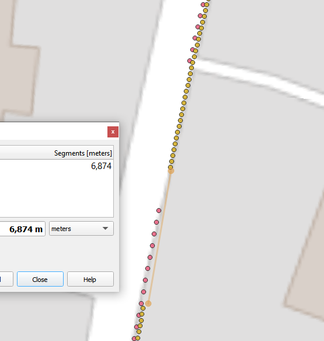
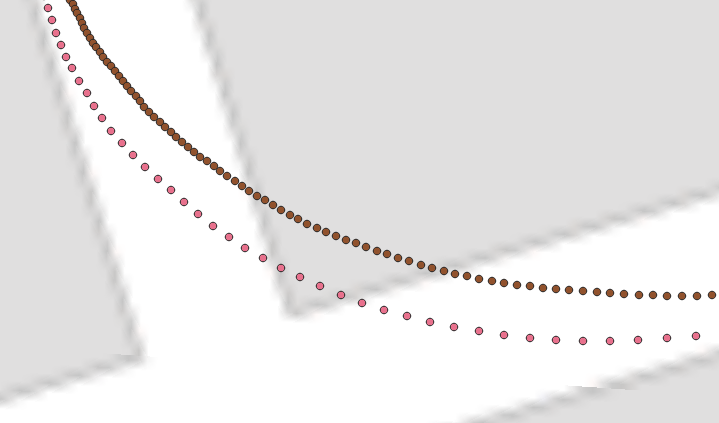
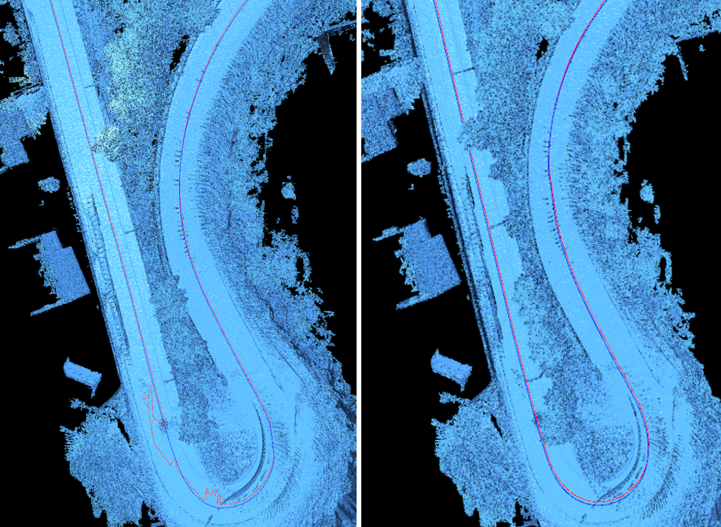
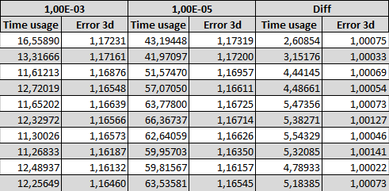

# Summary
This analysis is based on data collected from four locations in two different data collection campaigns (one without snow in 2021, and one with snow in early 2022) using a vehicle equipped with high-precision GNSS equipment, an IMU, and a LiDAR. The vehicle drove 6-8 trips each time in each location, about half of the trips with 10hz, and the other half with 20hz.

The collected LiDAR data was stored as PCAP files, and the GNSS coordinates as SBET files. Coordinates from the SBET files were matched against LiDAR frames in the PCAP files using their timestamps.

Site specific details and results can be found in the following documents:
- [Lillehammer](./../Lillehammer/results/summary.md)
- Dovre (not ready)
- Drivdalen (not ready)
- Lismarka (not ready)

## Data recording limitations
The data collection system ran in a loop that recorded LiDAR frames for 20 seconds, then saved them disk, then recorded for next 20 seconds, etc. This resulted in a slight gap between the files of about 1 to 1.5 seconds, or usually around 5-7 meters (depending on driving speed). This time delay was slightly reduced in time for the 2022 data collection campaign, but the gaps are still visible, and a potential problem for the registration algorithms.

To avoid registration problems every time the analysis progressed from one file to the next, the current position estimate is always translated to have the same offset from the first actual coordinate in the next file, as it had from the last actual coordinate in the previous file. This way, the analysis effectively skips the jump between the files.

## Matching GNSS coordinates against a LiDAR frame
A LiDAR frame is recorded while the LiDAR is spinning around. Recording a frame takes approximately X milliseconds, as shown by the series of timestamps recorded in the meta data of each frame. As the vehicle is moving while this happens, its position will have changed between the start and end of each frame. Testing showed that using the last timestamp in a frame gave the best match against the timestamps on the GNSS coordinates.

## Differences between 10hz and 20hz
The PCAP files with 20hz have approximately 0.135 meters between frames (depending on driving speed). The 10hz files have approximately double that (often closer to 0.300 meters).

10hz can be simulated from 20hz files by running them with --skip-every-frame 1, which makes the navigator skip every second frame. This was tested on a few runs of the Lillehammer 2021 dataset, and showed that [TODO: conclusion]

## NICP parameters
The most important parameters to the NICP algorithm are the threshold, and the maximum number of iterations. The threshold limits how far away point in the source and target point clouds can be and still be considered matches. Too high values here causes less precise registrations, while too low values can cause two sequential PCAP frames to not get a registration at all if they are different enough. The Lillehammer dataset has been run with different values of the threshold parameter: the initial attempt was touse a dynamic threshold to allow the navigation to get back on track after errors, but this resulted in a relatively poor estimation of the driving route with multiple small jumps, and often failures within a few hundred meters. In the end, a threshold of 1 seems to give very good results, and at least when registering every frame in the PCAP file, there is no need for higher thresholds in order to get back on track (because it never leaves the track in the first place).

The image below shows a comparison of the same area with threshold 2 (left) and 1 (right). Note how the navigation struggles at one point in the turn when running with a threshold of 2. A threshold of 1 gives a tighter match.

The NICP algorithm also has input parameters that allows us to set a relative_fitness or relative_rmse value that can stop the iteration before it reaches max_iterations if the fitness/rmse change between iterations gets smaller than that. This is the easiest way of setting a convergence criteria. But since those values are very abstract, the navigators instead run NICP with a relatively low max_iterations of 25 repeatedly, until the change in the movement part of the transformation matrix results in a translation less than 1e-3 meters. 1e-5 was also tested, but doubled the run time with no noticeable increase in precision.

The image below shows results for the 10 first frames in a random trip with a convergence criteria og 1e-3 (left) and 1e-5 (center), plus the difference between them (right). The difference is the values for 1e-5 divided by the values for 1e-3, showing that the time usage is 4-5 times as high, while the change in 3D error is usually less than a tenth of a percent.

